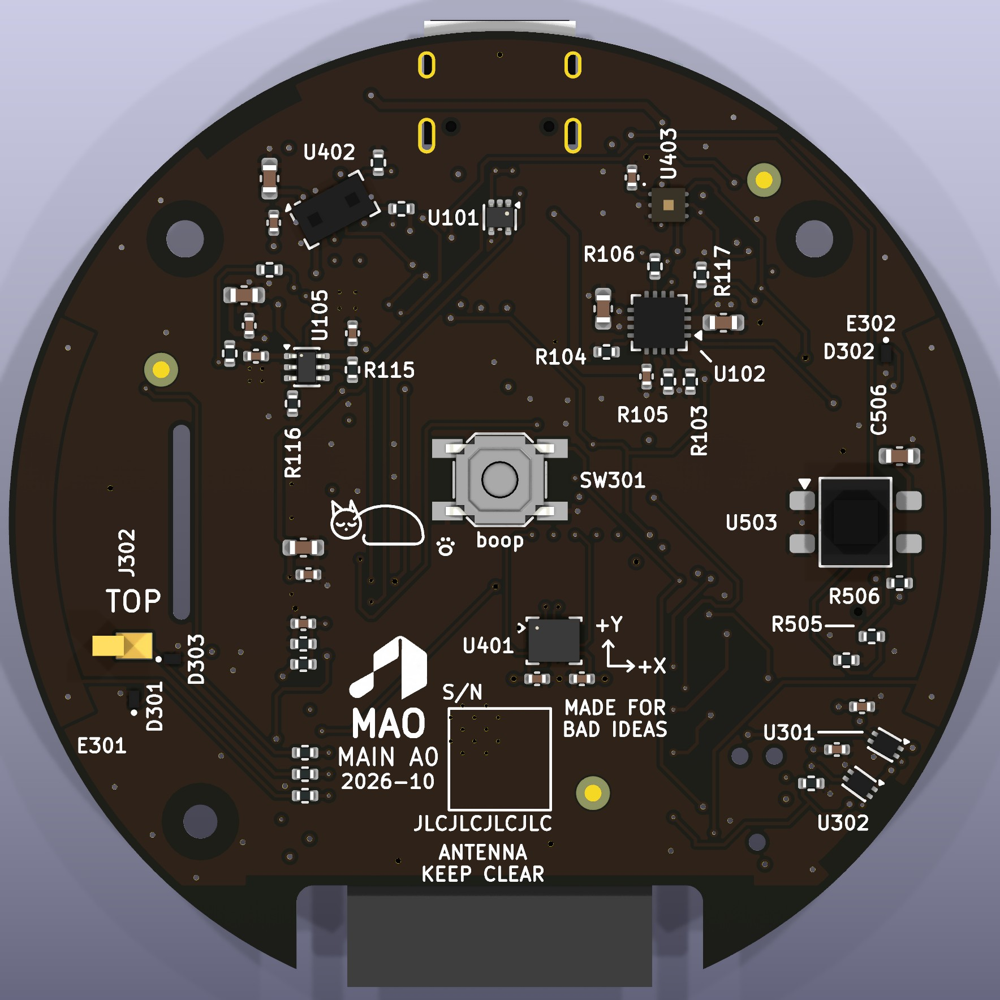
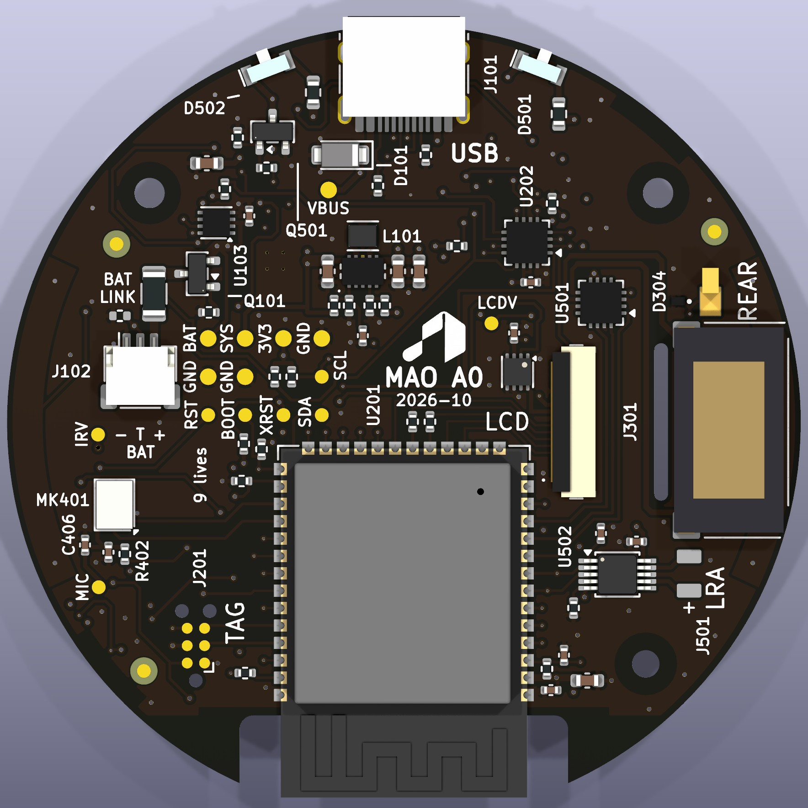
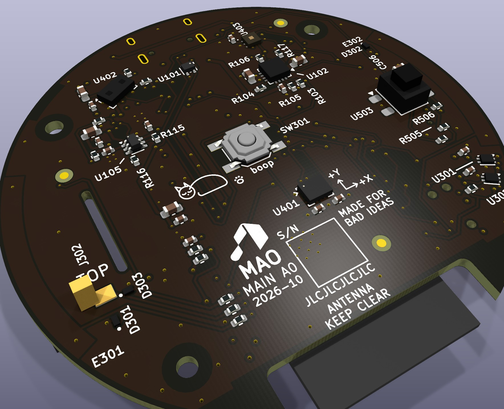
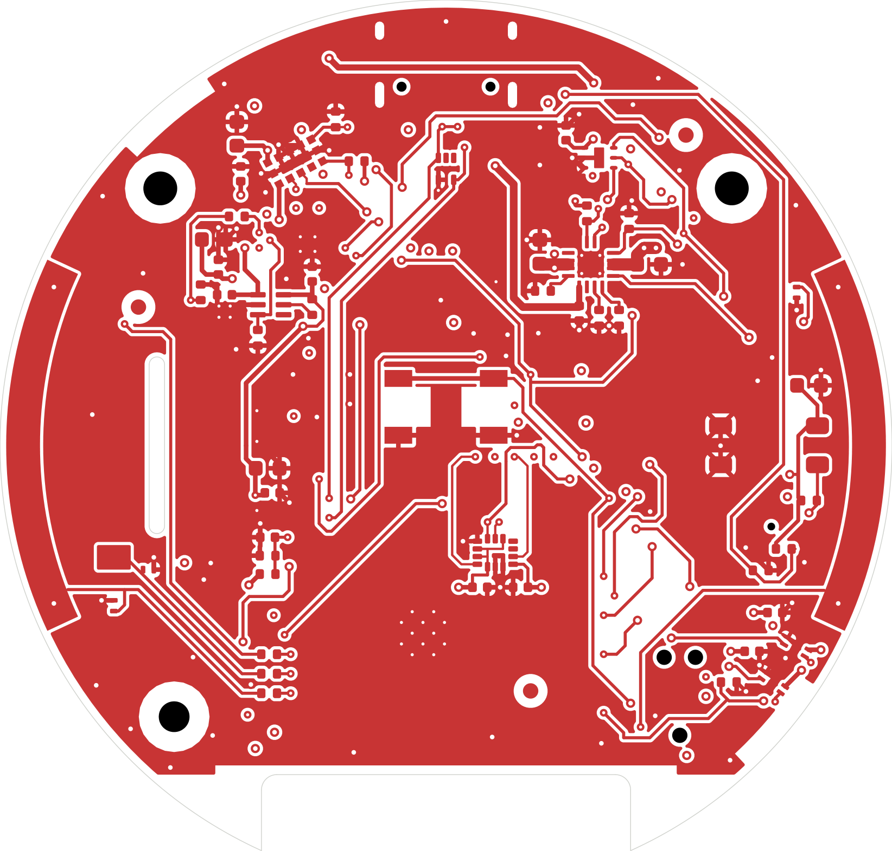
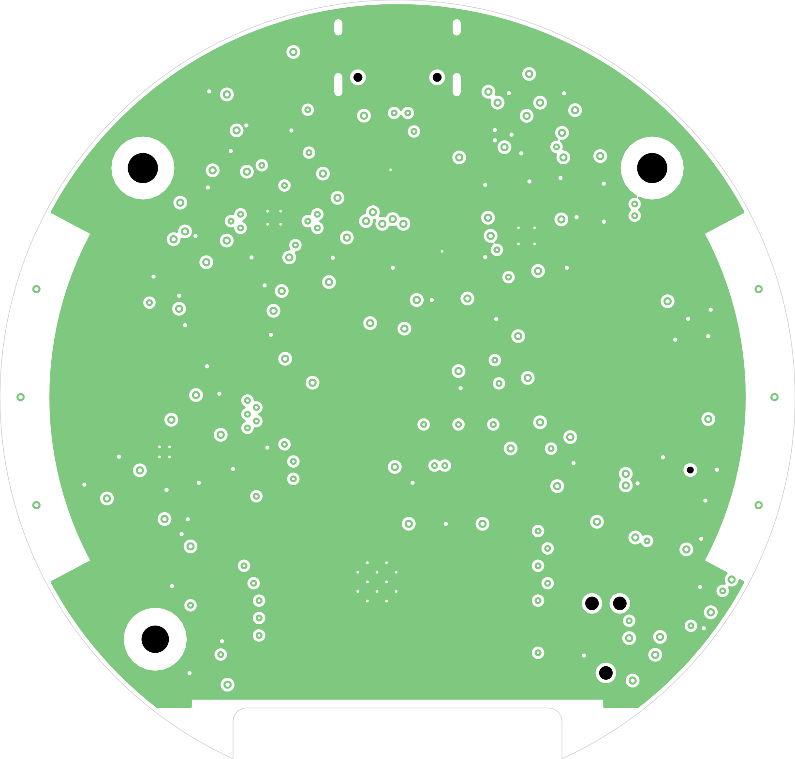
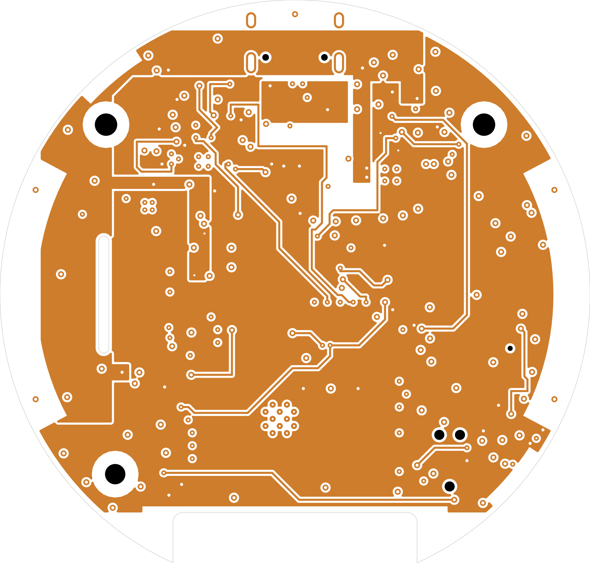
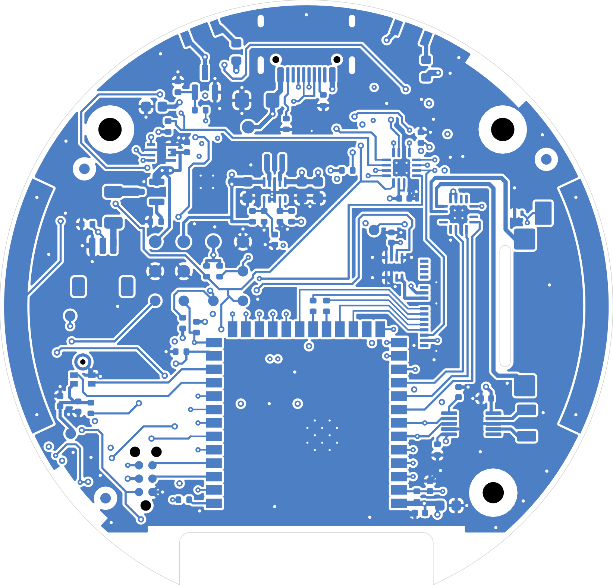

# MAO A0 FINAL REPORT

MAO_MAIN A0, 4-layer release, 2026-10-05.

- Design: `hardware/mao/`, generated from `hardware/mao/design/` by `pipeline.py`.
- Reviews: [`mao-rev-a0-review.md`](mao-rev-a0-review.md) (schematic, PCB, ODD JOBS, order readiness) and [`mao-odd-jobs-compliance.md`](mao-odd-jobs-compliance.md) (all 200 rules).
- Verification: [`mao-a0-verification.md`](mao-a0-verification.md) (simulation, three rounds of independent audits and what each changed).

| Face (display side) | Back (service side) |
|---|---|
|  |  |

| L1 F.Cu | L2 In1.Cu: solid GND | L3 In2.Cu: power + slow | L4 B.Cu |
|---|---|---|---|
|  |  |  |  |

### Hardware architecture

- **Form:** a Ø58 mm round board inside a ~Ø64 × 18.3 mm FDM puck.
  - The face is the stock Winstar WF0128BTYAA4DNN0 1.28" round GC9A01 panel behind a clear window. Its 70 mm tail
    lies as one loop under the panel, drops through a slot in the board at 9 o'clock and plugs into J301 on the back.
  - A ring dial with a 30-pole ferrite strip is read by two Hall latches; every step is a haptic tick.
  - Pressing the face is the button: it rocks on its lip on three printed flexures onto one switch.
  - Four hidden touch zones.
- **Processor:** ESP32-S3 module, with an I2C expander for the slow control lines.
- **Power:** single-cell LiPo.
  - A linear power-path charger (runs while charging) feeds VSYS.
  - A buck-boost makes 3.18 V, with a hardware UVLO.
  - Fuel gauge.
  - Every peripheral rail and enable is off at reset.
- **Antenna:** at 6 o'clock, over a notch in the board edge. The power section and USB-C are opposite, at 12–2 o'clock.
- **Board:** 4 layers (JLC04161H-1080):
  - L1 parts and critical lines;
  - **L2 solid GND**;
  - L3 power regions and slow lines;
  - L4 parts and lines.
- **Finish:** black mask, ENIG.

Detail: `mao-custom-board-architecture.md`; mechanics: `mao-mechanical.md`.

### Existing functionality preserved

- Display: same GC9A01 controller, resolution, colours and timing.
  - New: it plugs into J301, so a panel can be swapped without solder.
  - Added: a reset line, a TE (tearing-effect) line, a switched rail with a fixed slew, and a constant-current
    backlight driver (AW9364, 16 steps, 40 mA at the top: no PWM flicker, no way to overdrive the LEDs).
- Dial: 30 detents per turn and the same quadrature sequence, so `mao_input`'s decoder is unchanged.
- Press:
  - the face switch on GPIO0;
  - holding it during a reset still enters the ROM loader.
- Sound: the synthesised voice plays through an I2S amplifier with shutdown, replacing the always-on NS4150.
- Wireless: ESP-NOW / ODD BUS on the same channel and protocol as LAMP (C3).
- Character, app, persistent state (NVS `mao`), USB-Serial/JTAG console and flashing.
- One firmware tree builds both the ESP32-C3-LCDkit and the A0.
- IR: now real, with separate TX and RX. The LCDkit's IR was never configured.
- Nothing was dropped going from the 6-layer board to this 4-layer one.

### New perception hardware

| Sense | Part |
|---|---|
| Motion, orientation, tap, free-fall, pick-up | LSM6DSOX (wake-on-motion), on the face side with known axes |
| Approach, 0–1.3 m | VL53L4CD time-of-flight |
| Light / covered | OPT3004 |
| Hearing | SPH0641 PDM microphone |
| Touch: left, right, top, rear | ESP32-S3 native touch (rim arcs + spring electrodes) |
| Dial | 2 × DRV5012 + 30-pole ring |
| Battery state | MAX17048 fuel gauge, charger PGOOD; charging paused by firmware through /CE above 43 °C |
| IR receive / send | IRM-H638T, 2 × IR12-21C |

Physical feedback: a DRV2605L haptic driver with an LRA.

### MCU choice

**ESP32-S3-WROOM-1-N8R2**: 8 MB flash, 2 MB quad PSRAM, 85 °C. It is paired with a **TCA6408A** 8-bit I2C expander.

- The C3 has 15 usable GPIOs, no touch and no PDM input; the design needs 42 signals.
- The S3 adds:
  - native touch with deep-sleep wake;
  - two I2S units, so the mic and speaker run at once;
  - PSRAM for animation and audio.
- Quad PSRAM (not octal) keeps GPIO35–37 usable and keeps the 85 °C rating.
- Wake and fast lines stay native; the expander carries only rail enables, the charger's /CE and slow status.

### Major components

| Function | Part | LCSC |
|---|---|---|
| Module | ESP32-S3-WROOM-1-N8R2 | C2913204 |
| I/O expander | TCA6408ARGTR | C181499 |
| Charger | BQ24073RGTR | C15220 |
| 3.3 V buck-boost | TPS63802DLAR + DFE201612E-R47M | C2845237, C668312 |
| Fuel gauge | MAX17048G+T10 | C2682616 |
| Display rail switch | TPS22919DCKR | C2149796 |
| Backlight driver | AW9364DNR | C401007 |
| Display connector | HDGC 0.5K-HX-18PWB, 18-pin 0.5 mm back-flip FPC, top + bottom contacts | C2919497 |
| Reverse-polarity FET | AO3401A | C15127 |
| USB-C / ESD / TVS | TYPE-C-31-M-12, TPD2E2U06, SMF15A | C165948, C1972959, C123802 |
| IMU | LSM6DSOXTR | C481766 |
| ToF | VL53L4CDV0DH/1 | C3178291 |
| Ambient light | OPT3004DNPR | C2655153 |
| Microphone | SPH0641LU4H-1 | C2879853 |
| Hall latches | DRV5012AEDMRR × 2 | C2655038 |
| Speaker amp | MAX98357AETE+T | C910544 |
| Haptic driver | DRV2605LDGSR | C527464 |
| IR receiver / LEDs | IRM-H638T, IR12-21C × 2 | C91447, C53672 |
| Face switch | SKQGADE010 | C116647 |
| Battery connector | JST SH 3-pin (SM03B-SRSS-TB compatible) | C7430445 |
| Spring contacts (touch top/rear) | BW0019BG × 2 | C2826516 |

Bought separately (not on the BOM):
- Winstar WF0128BTYAA4DNN0 panel (stock, 70.1 mm tail);
- LP503035 cell with PCM and 10 k NTC;
- LD0832AA LRA;
- Same Sky CMS-150803-088S-X8 speaker (15 × 8 × 3 mm, 8 Ω, 0.8 W, own spring contacts);
- 30-pole flexible ferrite strip, 165 mm long, ≥ 8 mT at 1.5 mm;
- Tag-Connect TC2030-NL cable.

### Power system

**Path:** USB-C sink (5.1 k Rd) → SMF15A TVS → BQ24073.
- DPPM; USB100 until +3V3 is up, then USB500 (EN1 on +3V3).
- 207 mA charge (185–227 mA; the cell allows 250 mA).
- NTC 0–50 °C, timers on; firmware pauses charging through /CE at ≥ 43 °C board temperature (the cell allows
  0–45 °C) and resumes at ≤ 40 °C.

**VSYS** (4.4 V on USB, the cell voltage on battery) feeds:
- the TPS63802, which makes +3V3 = 3.18 V (2 A) and whose EN divider is a hardware UVLO (on 3.25 V, off 2.96 V;
  470 k / 240 k, filtered by 100 nF);
- the amplifier;
- the haptic driver;
- the IR LEDs;
- the panel backlight through the AW9364.

On the board, VSYS is an L3 band plus 0.3–0.8 mm B tracks (all of it leaves the charger through two 0.6/0.3 mm
vias), and +3V3 is the L3 plane.

**Cell side:**
- The cell needs its own PCM.
- R108 is a 0 Ω link for current measurement (BAT LINK).
- AO3401A provides reverse-polarity protection.
- MAX17048 gauges the cell.

**Switched rails, all off at reset:**
- display logic (TPS22919 load switch, fixed slew, controlled discharge);
- microphone (GPIO-powered through RC);
- IR receiver (expander-powered through RC).

**Enables, all off at reset:** amplifier SD, haptic EN, ToF XSHUT, backlight EN, Hall sampling.

**Budget (`mao-power-budget.md`, 500 mAh):**

| State | Battery current | Runtime |
|---|---:|---:|
| Active | ~141 mA | ~3.5 h |
| Drowsy | ~1.6 mA | ~13 days |
| Deep sleep | ~85 µA | ~8 months |

### GPIO

Every module GPIO is used natively except **GPIO46**, the download-boot strap, which is NC with its internal pull-down. That count includes USB, UART0 and the display TE line.

- **GPIO45**, the VDD_SPI strap (the module's flash voltage is fixed by eFuse), drives the AW9364's EN. The driver's 150 k EN pull-down and the pin's own pull-down hold it low during reset, so the backlight stays dark.
- **GPIO38** drives the IR LEDs (no reset pull-up on that pin), **GPIO39** the expander reset (its reset pull-up agrees with the 10 k on that line).
- **Expander:** all 8 bits are used; P6 is the charger's /CE.
- **Source:** `mao-pin-map.md`, generated from `pinmap.py`, which also generates the firmware header and the GPIO numbers in the schematic notes.

### Firmware

A0 support was committed as `faa39f7`; the panel-clock option followed with this board.

- **Board profiles:** `boards/lcdkit` and `boards/main_a0`, chosen by target. The pin header is generated from `pinmap.py`.
- **A0 HAL:**
  - shared I2C bus;
  - TCA6408A rails and status, with GPIO39 reset recovery;
  - display with runtime rotation and reset, SPI clock from `CONFIG_MAO_A0_LCD_PCLK_MHZ` (80 by default, 40 the
    fallback for the 70 mm tail);
  - AW9364 backlight: a 1-wire pulse-count driver behind `mao_board_backlight_set(percent)`;
  - I2S amplifier;
  - deep-sleep wake sources.
- **Drivers:**
  - `mao_power` (MAX17048, charger, the /CE thermal pause, power policy);
  - `mao_haptics` (DRV2605L);
  - `mao_sense` (LSM6DSOX incl. its die temperature, VL53L4CD, OPT3004, touch, PDM mic);
  - IR NEC.
- **Perception:** `mao_perception`, a platform-independent percept engine:
  - filters, hysteresis, fusion windows and confidence;
  - feeds `mao_events`;
  - the app reacts by context, never sensor-to-animation.
  - The IMU axis default matches the layout: +Z out of the face, per ST AN5192.
- **Input feel:** a haptic tick at every dial step and a firm click on every face press; the LEFT touch zone holds while the speaker amplifier runs.
- **Power policy:** ACTIVE / IDLE / DROWSY / deep sleep.
- **Boot and test:**
  - boot experience;
  - factory self-test (33 steps on A0) with `tools/factory_test.py`.
- **Builds (2026-10-05, against this pin map):**
  - all five configurations build with 0 warnings: s3-dev, s3-factory, s3-release, c3-dev, c3-release;
  - host unit tests: 240 checks, 0 failures.
- **Merging onto a newer firmware tree:** `docs/firmware/mao-a0-rev-merge.md` (what changed and why, the API
  changes, the porting steps, the checklist) with the full diff in `docs/firmware/mao-a0-rev.patch` (against
  `b17187e`).
- **Hardware assumptions:** every value only real hardware can confirm is a named constant marked VERIFY AT BRING-UP (`docs/firmware/mao-a0-firmware.md` §13).

### Board

| Item | Value |
|---|---|
| Stackup | JLC04161H-1080, 1.6 mm. F / 0.0764 prepreg / In1 GND / 1.265 core / In2 power / 0.0764 prepreg / B. 1 oz outer, 0.5 oz inner |
| Planes | L2 GND one piece, 2002 mm², no tracks. L3: +3V3 1348 mm², VSYS 332 mm², VBUS 33 mm², each one piece; the GND plane and the rail bands have no neck under 0.5 mm (`plane_check.py`) |
| Vias | **205** (146 × 0.6/0.3, 59 × 0.5/0.2), vs 230 on the 6-layer board; 73 of them GND, 12 at the rim. 24 × 0.2 mm thermal vias in exposed pads. No via touches an SMD pad |
| Copper | F 675 mm, B 774 mm, L3 227 mm (13 slow nets). All 921 segments at 0/45/90° |
| USB | D± on F over L2 (28.2 mm each, plus 2.2 / 6.1 mm on B at the ends); full speed |
| Fast lanes | Display SPI, I2S and PDM on B over their own uncrossed L3 cores, with no vias; no L3 track under any of them. The speaker outputs lie over the VSYS band. L3/L4 broadside 13.8 mm in all, all of it slow lines |
| Enclosure fit | Every part bodied; heights, keep-outs, the wall (every body inside r 29.0 except the wall-opening parts), the tail path and the tab spots checked by script |
| Silkscreen | 83 texts, checker 0 findings. Mark, MAO / MAIN A0 / 2026-10 and an S/N field on the face; mark and identity on the back; every test pad named; references for every IC, connector and semiconductor and every procedure-named R/C, the rest on the assembly drawing. Five small eggs, each hidden once assembled: a sleeping cat with paw prints and "boop" at the face switch and ODD JOBS' "MADE FOR BAD IDEAS" under the panel, "9 lives" under the cell, "meow" under the speaker (MAO is Mandarin for cat) |

### Manufacturing

**Board:**
- JLCPCB 4-layer **JLC04161H-1080**, 1.6 mm, FR-4 TG155.
- 1 oz outer, 0.5 oz inner copper.
- ENIG, matte black mask, white legend.
- Through vias only: 0.3/0.6 and 0.2/0.5 mm, tented.
- Epoxy-filled and capped (POFV) for the exposed-pad vias if offered.
- No impedance control (USB full speed only).
- Order single boards. Panel tabs, if needed, only at 130° and 328° (about 4 and 11 o'clock), where copper on
  every layer is pulled back 1.55 mm from the edge (FAB-NOTES).

**Assembly:**
- JLC PCBA, both sides: **112 parts, 48 BOM lines**, every line with an LCSC number.
- J301, the display connector, is fitted by JLC on the back; the panel's tail passes through the slot and plugs in after assembly.
- USB-C shell legs: THT assembly or hand-solder.
- Fitted by JLC: the springs.
- Hand-fitted after assembly: the LRA leads.

**Files** (`hardware/mao/outputs/fab/`, regenerated from the final board):
- `MAO_MAIN_A0-gerbers.zip`: 4 copper layers, mask, paste, silk, outline, Gerber job, Excellon PTH/NPTH, drill maps;
- `BOM-MAO_MAIN_A0-JLC.csv`;
- `CPL-MAO_MAIN_A0-JLC.csv` (+ KiCad CPL);
- `ASSEMBLY-MAO_MAIN_A0-top.pdf` / `-bottom.pdf`: A3 at 4.5:1, every reference legible (previews in `plots/mao-main-a0-assembly-*.png`);
- `FAB-NOTES.txt` (order options, assembly notes, polarised parts to check, panel tabs).

**Schematic** (`hardware/mao/outputs/`): PDF and SVG, netlist, ERC/DRC reports, plane report, enclosure check, panel-tab and stack-up reports.

**Checks:**
- ERC 0, including KiCad's default-off checks run once: only deliberate footprint-filter notes.
- DRC 0 at all severities, 0 unconnected, 0 parity.
- Every L2/L3 plane in one piece.
- Silkscreen checker: 0 findings.
- Enclosure check (`mech_check.py`): 0 findings.
- 45°: every segment.
- Gerbers reviewed outside KiCad (`plots/mao-main-a0-gerbers.png`); the drill file reconciles with the board (0.3 mm × 150 = 146 vias + 4 electrode joins; 0.2 mm × 83 = 59 vias + 24 exposed-pad vias; 4 slots; 9 NPTH).
- Simulations S1–S14 pass (`mao-a0-verification.md`).

### Known risks

1. **No enclosure CAD yet.** Every mechanical check is arithmetic against `mechanical.py`: heights, keep-outs, the
   wall, the tail path. The first printed puck is the real fit check (risk 11).
2. **Panel tail.** The 70 mm tail must arrive with panel pin 1 at the 12 o'clock end of J301 (pad 18). Bring-up §3
   checks it with the tail laid in unlatched before the first power, and runs the colour test at 80 MHz (40 MHz
   fallback in Kconfig). The loop's turn in the carrier well must hold up to a few hundred presses.
3. **Antenna detuning** by the cell, the panel (its edge is 3.65 mm from the antenna boundary in plane), the LRA's
   steel can (about 7.4 mm from the antenna's corner) and the enclosure. The module has no matching network;
   measure RSSI against the LCDkit.
4. **Touch sensitivity** through the 2 mm wall and the ring. Thresholds are tuned at bring-up; the fallback is conductive filament or copper tape.
5. **Ring dial.** The ferrite strip must give ≥ 8 mT at the sensors (they switch at ±3.3 mT); with the FDM gap tolerance, check that every one of the 30 steps registers.
6. **ToF window crosstalk.** It needs the light-blocking gasket specified in `mao-mechanical.md` §5 and factory calibration.
7. **Buck-boost ripple** with 0603 output capacitors at 3.18 V bias. Measure it; the A1 fallback is 47 µF 0805.
8. **Charger temperature** at a low cell (0.72 W worst case, under the panel). Bring-up §4 looks at the panel with a
   thermal camera while charging a 3.0 V cell; the fallback is a resistor swap to 200 mA. The charge pause reads
   the IMU's die temperature, about 20 mm away: its offset is characterised at bring-up.
9. **First use of four footprints:** JST SH clone, DFE201612E, the HDGC J301 and the springs. Inspect the first boards under a microscope.
10. **Exposed-pad thermal vias** are unplugged unless POFV is chosen. Watch for voids under U102, U202 and U501 (X-ray if offered).
11. **Enclosure first fit.** The puck is printed from the specification. Check on the first print:
    - the IR receiver's 0.35 mm worst-case clearance under the pressed window;
    - the face flexures: preload (about 0.3 N) and an even click across the face;
    - the tail pocket, well and rim channel;
    - the speaker cradle: contact pressure on LS501 and the front-chamber seal;
    - the TOP spring boss;
    - the ToF and mic gaskets.
12. **LEFT touch near the speaker.** The speaker lies partly over the LEFT electrode; firmware holds that zone while the amplifier runs. Check LEFT sensitivity with the speaker fitted.
13. **USB start without a cell.** The charger starts in USB100 until +3V3 is up; bring-up §1 checks a cold start on USB with no cell and with a flat cell.

### DNP / optional components

- **R110** (DNP): battery NTC substitute. Fit it only for a 2-wire cell without a thermistor.
- **Footprints that are not parts:**
  - test pads TP1–TP11, TP13–TP16;
  - Tag-Connect J201;
  - touch electrodes E301/E302 (copper);
  - LRA pads J501;
  - speaker contact pads LS501 (the speaker presses on them);
  - fiducials FID1–FID6;
  - mounting holes H1–H3.
- **J301 is fitted:** it is a real connector, on the back, facing the tail slot.

### Bring-up sequence

Full procedure: `mao-bringup.md`.

1. Inspect the board. Check R108 is fitted and that no rail is shorted to GND at the test pads.
2. Power VBUS only from a current-limited supply on TP6 (100 mA, no cell, no panel). Check:
   - TP4 SYS 4.3–4.5 V;
   - TP3 3V3 3.10–3.32 V (3.18 V nominal);
   - TP13–TP15 < 0.3 V;
   - a cold start with no cell (scope VSYS and +3V3).
3. Connect USB. It enumerates as USB-Serial/JTAG. Flash `s3-dev` (hold the face, or TP8 BOOT, during a reset to force the ROM loader; the Tag-Connect UART is the fallback).
4. Run `mao selftest auto nopads`; the automatic steps must pass. Then check that TP13 switches when the display rail is enabled.
5. Lay the panel's tail in J301 unlatched and confirm pin 1 at the 12 o'clock end; then plug it in, power with the backlight off, and check the boot experience, orientation and the 80 MHz colour test.
6. Connect the cell, after checking its pinout on receipt. Then check:
   - charging current through R108's pads;
   - the charge pause (`mao power charge off`, then by heating);
   - UVLO thresholds;
   - running from the cell.
7. Bring up each subsystem in order: backlight steps, speaker, haptics, IMU, ToF, light, mic, touch, dial, IR, radio. Then do the enclosure first fit.
8. Measure the power states and fill in `mao-power-budget.md`.
9. Run the full factory self-test with the fixture (`mao-factory-test.md`).

### ODD JOBS standard

All 200 rules are checked one by one in [`mao-odd-jobs-compliance.md`](mao-odd-jobs-compliance.md): 141 ✓, 45 ✓\* (met,
with the reason or bring-up check recorded), 6 ◐ (partly met, A1 action named), 8 N/A. No rule fails. The third
independent ODD JOBS audit found no FAIL (audit 2: 15) and the fixes it recommended are in. The partly met rules are
cosmetic or documentary: router hairpins (88), library outlines over tented vias and the S/N field over the module's
thermal vias (94, 101), the label-connected schematic (187, 188) and the missing 1:1 footprint print (193). The release
gate is **EVT** (engineering prototype), and the DVT items for antenna, connectors, ESD and power architecture are
already met.

The golden rule:

| Question | Answer |
|---|---|
| Can it boot? | Yes: straps defined, every rail and enable off at reset |
| Can it be flashed? | Yes: USB, plus the Tag-Connect UART |
| Can it be recovered? | Yes: ROM loader by holding the face or TP8 during a reset (TP7, Tag-Connect EN, or USB with no cell) |
| Can it be measured? | Yes: 15 named pads and BAT LINK |
| Can it physically fit? | On paper, yes: every part bodied and checked for height, keep-outs, the wall and the tail path. No enclosure CAD yet, so the first print confirms it |

### Final status

**READY FOR 5-UNIT A0 PROTOTYPE ORDER — 4 LAYER**

Three rounds of independent audits ran on this board (`mao-a0-verification.md`). The first withdrew the board
(blockers in the backlight, the panel tail, the IR reset state and the window parts). The second found the module in
the enclosure wall, a creased tail fold and 13 more ODD JOBS failures. The third, on the final board, found no
electrical blocker and no failed ODD JOBS rule; its one electrical issue (a 0.27 mm neck in the VSYS feed) and its
recommended fixes are made and re-measured.

Every gate of the 4-layer review passes (`mao-rev-a0-review.md` §2.1):
- DRC/ERC/parity 0 and nothing unconnected;
- L2 continuous, every L3 rail band without a neck under 0.5 mm;
- power robust;
- USB and SPI references uninterrupted;
- I2S/PDM clean;
- touch and antenna keep-outs correct;
- no functionality removed;
- service access;
- visual standard.

Accepted for the EVT (user decisions and named checks): no enclosure CAD (risk 1, the first print is the fit check);
the speaker under the LEFT touch arc (firmware holds LEFT); the LRA 7.4 mm from the antenna (RSSI A/B check).

At order time:
- choose JLC04161H-1080, black mask and ENIG, as in FAB-NOTES;
- check JLC's placement preview (FAB-NOTES lists every polarised part);
- get the Winstar WF0128BTYAA4DNN0 specification with the panels and keep it with the design files: bring-up
  checks the tail's orientation against it before the first plug-in.
