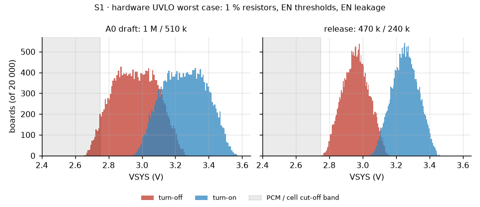
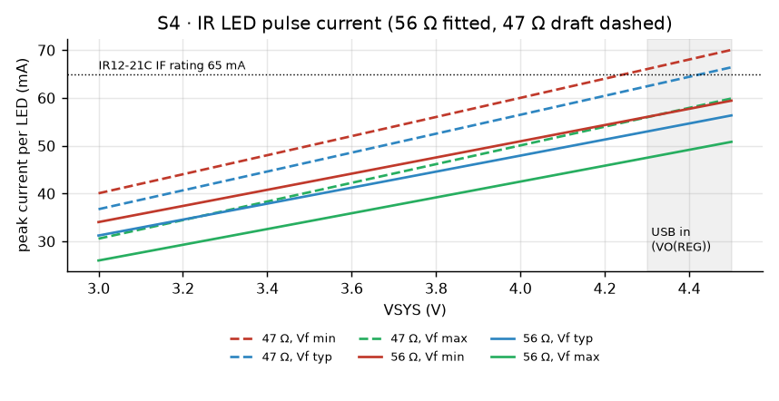
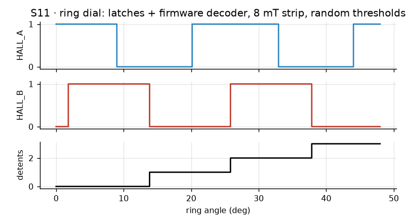

# MAO_MAIN A0 verification

Final pre-order verification of the 4-layer MAO_MAIN A0, 2026-10-05. It covers:

1. release checks on the real board files;
2. circuit simulation of every analog block and of the ring dial with its firmware decoder;
3. a visual review of both faces;
4. two independent audits: the ODD JOBS standard, rule by rule, and an electrical review.

Every finding was verified before it was acted on. Values changed by this pass are listed in
[Changes](#changes-made-by-this-verification).

## Summary

| Check | Result |
|---|---|
| ERC (all checks KiCad runs by default) | 0 violations |
| DRC, all severities, warnings included | 0 violations, 0 unconnected, 0 schematic parity |
| Plane continuity (L2 GND, L3 +3V3 / VSYS / VBUS) | every plane one piece |
| Silk text check | 66 texts, 0 findings; 108 references on Fab (designator policy) |
| Fab package | 12 Gerbers, 4 drill files, BOM 49 lines / 112 fitted parts, CPL 112 rows; 1 DNP (R110) |
| BOM ↔ board ↔ capture | 112 fitted + 1 DNP in all three; every line has an LCSC number |
| Firmware | 5 configurations (S3 dev / factory / release, C3 dev / release): 0 errors, 0 warnings |
| Host tests | 160 checks, 0 failures |
| Simulation (S1–S15) | all pass after three value changes (below) |
| Visual review | both faces rendered and reviewed; no defects |
| ODD JOBS audit | see [Audits](#audits) |
| Electrical audit | see [Audits](#audits) |

## Simulation

ngspice is KiCad 10's own `libngspice`, driven from Python (`hardware/mao/sim/`). Device models are fitted to
the datasheet points named in each row. Statistics, the dial decoder and the datasheet arithmetic run in
Python. Reproduce with:

```
python3 hardware/mao/sim/run_sims.py
```

Plots and `results.json` are written to `docs/hardware/sim/`.

| # | Block | Model and corners | Result | Verdict |
|---|---|---|---|---|
| S1 | Hardware UVLO (TPS63802 EN divider) | 20 000 boards: 1 % resistors, EN 1.07–1.13 V rising / 0.97–1.03 V falling, EN leakage ±0.2 µA | 470 k / 240 k: off 2.75–3.16 V, on 3.05–3.46 V, hysteresis ≥ 0.29 V. The 1 M / 510 k draft reached 2.65 V off and 3.57 V on: the leakage × 1 MΩ alone was ±0.2 V | **pass after change** |
| S2 | Reverse-polarity FET Q101 (AO3401A, gate to GND) | level-1 PMOS fitted to RDS(on) at VGS = −2.5 / −4.5 V; cell 3.0–4.2 V, 0.15 Ω | 43–63 mV at 0.6 A, 29 mV while charging at 297 mA. Reversed cell, battery only: 0 µA. Reversed cell with USB: VBAT settles at 0.94–0.96 V, below the charger's 1.6 V VBAT(SC), so the BQ24073 stays in its 4–11 mA probe and the pack sees at most 11 mA (57 mW in Q101) | pass |
| S3 | Backlight (2 LEDs ∥, 10 Ω, AO3400A) | white-LED model per panel bin: Vf 2.8 / 3.0 / 3.2 V at 20 mA per LED; 3V3 3.25–3.35 V | 17–50 mA at full PWM (33 mA typical). The 2.8 V bin exceeds the panel's 40 mA, so firmware now caps PWM at 80 %: worst average 39.9 mA. The 3.2 V bin is dim (14–19 mA average); bring-up measures the fitted panel (below) | **pass after change** |
| S4 | IR LEDs (IR12-21C, own resistor each) | IR-LED model, Vf 1.05 / 1.20 / 1.50 V at 20 mA; resistor ±1 %; VSYS 3.0–4.5 V (4.5 V = BQ24073 VO(REG) max on USB) | 56 Ω: 26–59 mA peak, under the 65 mA rating everywhere. The 47 Ω draft reached 66 mA typical and 70 mA worst case on USB | **pass after change** |
| S5 | Mic supply (GPIO → 100 Ω → 1 µF + 100 nF) | GPIO as 3.3 V behind 30 Ω, SPH0641 at 0.62 mA | 3.22 V steady, settled in 0.66 ms, 26 mA inrush peak (40 mA GPIO limit) | pass |
| S6 | IR receiver supply (expander → 100 Ω → 4.7 µF) | IRM-H638T 0.7 mA max + 10 k pull-up loaded | 3.17 V steady (≥ 2.7 V), above 2.7 V after 1.2 ms, 26 mA peak (50 mA pin limit) | pass |
| S7 | I2C, 2.2 k pull-ups, 400 kHz | measured bus: 101 mm of track, 6 vias, 7 devices → 62 pF typical, 100 pF with every pin at its 10 pF maximum | rise (30–70 %) 116 / 186 ns against the Fast-mode 300 ns; VOL 12 mV, 1.5 mA sink | pass |
| S8 | Board-ID divider (1 M / 1 M / 100 nF) | 3V3 soft start 1 ms | 1.65 V final (window 1.40–1.90 V), above 1.40 V at 95 ms; firmware samples at 150 ms | pass |
| S9 | ESP32-S3 EN (10 k / 1 µF) | same ramp | EN reaches VIH 13.5 ms after +3V3 is up (datasheet: ≥ 0.05 ms) | pass |
| S10 | Display rail (TPS22917, CT 1 nF) | datasheet slew 1.9 V/ms, 10.5 µF load (incl. 4.7 µF panel estimate) | 1.6 ms rise, 20 mA inrush, 0.7 mV dip on +3V3; firmware waits 10 ms | pass |
| S11 | Ring dial: 30-pole strip, 2 × DRV5012, firmware decoder | the `mao_input.c` decoder ported line for line; each latch with random BOP 0.6–3.3 mT / BRP −0.6 to −3.3 mT and its own 2.5 kHz ± 30 % sampling clock; ±15 % pole-to-pole strength; peak field 8 / 5 / 4 mT; random moves at 0.1–4 rev/s, stops anywhere (the ring has no detent), reversals, then N whole turns back | 180 random-walk trials: never off by more than the ±1 start/stop partial detent, no drift, 0 invalid transitions. Spins of 3 turns at 0.2–10 rev/s: 89–90 detents (one lost to the first sync). Needs a peak field above BOP max 3.3 mT; the strip is specified ≥ 8 mT at 1.5 mm (2.4× margin) | pass |
| S12 | Speaker (MAX98357A, GAIN_SLOT open) | datasheet full scale 2.1 dBV + 9 dB = 3.59 Vrms; firmware gain 0.58 | 2.08 Vrms: 0.54 W into 8 Ω, 0.68 W at the 6.4 Ω impedance minimum, under the 0.8 W rating. Clips by 0.3 dB only at VSYS 3.0 V | pass |
| S13 | Charger heat (BQ24073, USB500, ISET 3.0 k) | VBUS 4.75–5.25 V, VBAT 3.0–4.1 V, KISET max (325 mA), θJA 60 °C/W (JEDEC 44.5 + 35 % for a closed puck), 45 °C inside | worst 0.86 W → TJ 97 °C, under the 125 °C fold-back | pass |
| S14 | Buck-boost inductor (0.47 µH, Isat 5.5 A) | 0.6 A load; buck / buck-boost / boost at the datasheet frequencies | peak 1.0–1.3 A, under half of the 3.8 A minimum switch limit and of Isat | pass |
| S15 | Runtime | power-budget rows × 85 % usable capacity above the UVLO | active 3.2 h, active with radio power save 5.7 h, idle 3.7 h, drowsy 11 days, deep sleep 8 months | pass (budget doc says nameplate) |

Plots: [UVLO](sim/s1_uvlo.png) · [Q101](sim/s2_rpp.png) · [backlight](sim/s3_backlight.png) ·
[IR](sim/s4_ir.png) · [switched supplies](sim/s5_s6_switched_supplies.png) · [I2C](sim/s7_i2c.png) ·
[reset and board ID](sim/s8_s9_reset_id.png) · [display rail](sim/s10_lcd_rail.png) · [dial](sim/s11_dial.png)





### What simulation cannot prove

These are measured at bring-up (`mao-bringup.md`):

- **Backlight bin.** Measure the voltage across R303 at 100 % brightness: I = V / 10 Ω. Above 50 mA, or below
  15 mA average, contact the panel supplier about the Vf bin.
- **Strip field.** Measure the strip with a gaussmeter at the Hall height (≥ 8 mT), then spin the ring three
  turns: the dial counter must read 90 ± 1.
- **RF.** Antenna match and range with the enclosure closed. No simulation here covers the antenna.
- **Thermal.** Charger case temperature after 30 min of charging from 3.0 V inside the closed puck
  (< 85 °C on the package).

## Changes made by this verification

| Item | Before | After | Why |
|---|---|---|---|
| R111 / R112 (UVLO divider) | 1 M / 510 k | 470 k / 240 k (C25790, C64043) | S1: EN leakage × 1 MΩ moved the cut-off to 2.65 V worst case; now 2.75–3.16 V. Cost 3.1 µA |
| R501 / R502 (IR LEDs) | 47 Ω (C23182) | 56 Ω (C25196) | S4: 66–70 mA on USB, over the 65 mA rating; now ≤ 59 mA. About 15 % less IR at the same VSYS |
| Backlight firmware | 100 % = 100 % PWM | 100 % = 80 % PWM (`A0_BACKLIGHT_MAX_PCT`) | S3: the 2.8 V panel bin draws 50 mA; the average now stays ≤ 40 mA on every bin |
| Docs | speaker "≤ 0.4 W"; UVLO 3.26 V; IR 42–66 mA; deep sleep 70 µA | 0.54 W; 3.25 V; 26–59 mA; 73 µA | numbers now come from the simulation |

No copper, placement or silk changed: the board took the new values through `sync_fields.py`, and the
Gerbers are byte-identical apart from their timestamps.

## Visual review

Both faces were rendered from the release board (`renders/`) and reviewed as a product photograph would be:

- the brand mark, revision block and S/N box;
- every silk label (all upright or reading along their part, none on a pad or a body);
- the test-pad rows;
- the antenna keep-out;
- black solder mask with ENIG.

No defects were found. The designator policy holds: silk references for ICs, connectors, semiconductors,
electrodes, and every R/C named in the bring-up or factory-test docs; all others on Fab and in the assembly
PDFs.

## Audits

_Filled in from the two independent audits below._
