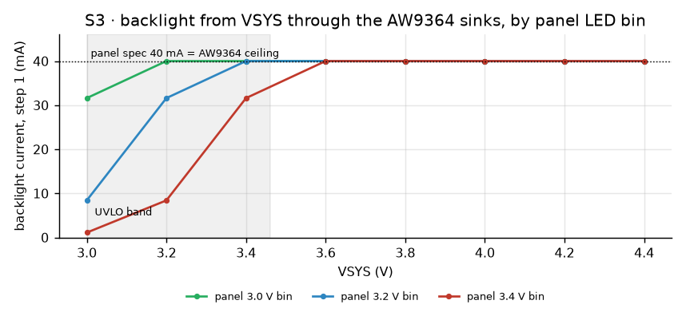

# MAO_MAIN A0 verification

Pre-order verification of the 4-layer MAO_MAIN A0, 2026-10-05, in three rounds:

1. **First round** on the board as released: release checks, circuit simulation of every analog block and of the
   ring dial with its firmware decoder, a visual review of both faces, and two independent audits (the ODD JOBS
   standard rule by rule, and an electrical review). The audits found blockers, and the board was withdrawn.
2. **Revision** (A0 rev, same date): the blockers fixed in the circuit, the placement, the copper, the silk and
   the firmware; then every check run again, plus a second pair of audits.
3. **Second round** (same date): the second audits' findings fixed (module inside the outline, tail loop,
   stitching, broadside, silk policy, assembly drawing, schematic, docs), every check run again, and a third pair
   of independent audits on the final board.

Every finding was verified before it was acted on. The revision's changes are listed in
[Revision](#revision-what-changed-and-why).

## Summary (revised board)

| Check | Result |
|---|---|
| ERC (all checks KiCad runs by default) | 0 violations |
| DRC, all severities, warnings included | 0 violations, 0 unconnected, 0 schematic parity |
| Plane continuity (L2 GND, L3 +3V3 / VSYS / VBUS) | every plane one piece (`outputs/PLANES.json`) |
| Silk text check (`check_silk_text.py`: overlaps, pads, vias, holes, crowding, size, direction, ambiguity) | 84 texts, 0 findings |
| Enclosure check (`mech_check.py`: every part's 3D-model height against the stack, keep-outs, wall clearance, tail path) | 142 parts, 0 findings; every body inside r 29.0 except the wall-opening parts; speaker 1.1 mm from the wall |
| Panel tabs (`panel_tabs.py`) | 130° and 320°: no copper within 1.55 mm of the edge on any layer, no part within 1.35 / 2.13 mm |
| Fab package | 12 Gerbers, 4 drill files, BOM 48 lines / 112 fitted parts, CPL 112 rows; 1 DNP (R110) |
| Vias | 208 through vias (148 × 0.6/0.3 mm, 60 × 0.5/0.2 mm; 74 GND, 12 of them at the rim), 24 thermal vias in exposed pads; the 6-layer first pass had 230. Drill file reconciles: 0.2 × 84, 0.3 × 152 (148 + 4 electrode joins), 4 PTH slots, 9 NPTH |
| Routing | 930 segments, all at 0/45/90° (none off by more than 0.05°); 108.5 mm at 0.15 mm; L3/L4 broadside 17.4 mm (was 53.7) |
| Firmware | 5 configurations (S3 dev / factory / release, C3 dev / release): 0 errors, 0 warnings |
| Host tests | 240 checks, 0 failures |
| Simulation (S1–S15) | all pass |
| Visual review | both faces rendered (`docs/hardware/renders/`), see [Visual review](#visual-review) |
| Audits | three rounds, see [Audits](#audits) |

## Simulation

ngspice is KiCad 10's own `libngspice`, driven from Python (`hardware/mao/sim/`). Device models are fitted to
the datasheet points named in each row. Statistics, the dial decoder and the datasheet arithmetic run in
Python. The +3V3 rail is 3.18 V since the revision. Reproduce with:

```
python3 hardware/mao/sim/run_sims.py
```

Plots and `results.json` are written to `docs/hardware/sim/`.

| # | Block | Model and corners | Result | Verdict |
|---|---|---|---|---|
| S1 | Hardware UVLO (TPS63802 EN divider) | 20 000 boards: 1 % resistors, EN 1.07–1.13 V rising / 0.97–1.03 V falling, EN leakage ±0.2 µA | 470 k / 240 k: off 2.75–3.16 V, on 3.05–3.46 V, hysteresis ≥ 0.29 V. The 1 M / 510 k draft reached 2.65 V off and 3.57 V on: the leakage × 1 MΩ alone was ±0.2 V | pass |
| S2 | Reverse-polarity FET Q101 (AO3401A, gate to GND) | level-1 PMOS fitted to RDS(on) at VGS = −2.5 / −4.5 V; cell 3.0–4.2 V, 0.15 Ω | 43–63 mV at 0.6 A, 22 mV while charging at 227 mA. Reversed cell, battery only: 0 µA. Reversed cell with USB: VBAT settles at 0.94–0.96 V, below the charger's 1.6 V VBAT(SC), so the BQ24073 stays in its 4–11 mA probe | pass |
| S3 | Backlight: panel LEDs (two in parallel) from VSYS into the AW9364 sinks LED1 + LED2 | white-LED model per Winstar bin, Vf 3.0 / 3.2 / 3.4 V at 20 mA per LED; sinks regulated at 40 mA, 2.5 Ω per sink below the 50 mV dropout; VSYS 3.0–4.4 V | 40 mA at step 1 on every bin above VSYS 3.2 V (3.0 V bin), 3.4 V (3.2 V bin), 3.6 V (3.4 V bin); dimmer below. Never above 40 mA nominal; the part's ±17.5 % makes it 33–47 mA. Driver dissipation 56 mW at 40 mA, 66 mW at 47 mA (VSYS 4.4 V, Vf 3.0 V; +5 °C). At the datasheet's 170 mV maximum dropout the full-current points move up 0.12 V. Steps (17 − n)/16 × 40 mA | pass |
| S4 | IR LEDs (IR12-21C, own resistor each) | IR-LED model, Vf 1.05 / 1.20 / 1.50 V at 20 mA; resistor ±1 %; VSYS 3.0–4.5 V | 56 Ω: 26–59 mA peak, under the 65 mA rating everywhere | pass |
| S5 | Mic supply (GPIO → 100 Ω → 1 µF + 100 nF) | GPIO as 3.18 V behind 30 Ω, SPH0641 at 0.62 mA | 3.10 V steady, settled in 0.66 ms, 25 mA inrush peak (40 mA GPIO limit) | pass |
| S6 | IR receiver supply (expander → 100 Ω → 4.7 µF) | IRM-H638T 0.7 mA max + 10 k pull-up loaded | 3.05 V steady (≥ 2.7 V), above 2.7 V after 1.3 ms, 25 mA peak (50 mA pin limit) | pass |
| S7 | I2C, 2.2 k pull-ups, 400 kHz | measured bus: 7 devices, 62 pF typical, 100 pF with every pin at its 10 pF maximum | rise (30–70 %) 116 / 186 ns against the Fast-mode 300 ns; VOL 12 mV, 1.45 mA sink | pass |
| S8 | Board-ID divider (1 M / 1 M / 100 nF) | 3V3 soft start 1 ms | 1.59 V final (window 1.40–1.90 V; self-test 1.48–1.70 V), above 1.40 V at 107 ms; firmware samples at 150 ms | pass |
| S9 | ESP32-S3 EN (10 k / 1 µF) | same ramp | EN reaches VIH 13.4 ms after +3V3 is up (datasheet: ≥ 0.05 ms) | pass |
| S10 | Display rail (TPS22919, fixed slew) | datasheet SRON 1.8 / 2.7 mV/µs at 1.8 / 3.6 V, interpolated to 3.18 V; 10.5 µF load (incl. 4.7 µF panel estimate) | turn-on (t_ON) 1.69 ms, 10–90 % rise 1.02 ms, 26 mA inrush, 0.9 mV dip on +3V3; firmware waits 10 ms | pass |
| S11 | Ring dial: 30-pole strip, 2 × DRV5012, firmware decoder | the `mao_input.c` decoder ported line for line; random latch thresholds and sampling clocks; peak field 8 / 5 / 4 mT; random moves, stops, reversals | 180 random-walk trials: never off by more than the ±1 start/stop partial detent, 0 invalid transitions. Spins of 3 turns: 89–90 detents. Needs a peak field above 3.3 mT; the strip is specified ≥ 8 mT | pass |
| S12 | Speaker (MAX98357A, GAIN_SLOT open) | datasheet full scale 2.1 dBV + 9 dB = 3.59 Vrms; firmware gain 0.58 | 2.08 Vrms: 0.54 W into 8 Ω, 0.68 W at the 6.4 Ω minimum, under the 0.8 W rating | pass |
| S13 | Charger heat (BQ24073, USB500, ISET 4.3 k) | VBUS 4.75–5.25 V, VBAT 3.0–4.1 V, KISET max (227 mA), θJA 60 °C/W (JEDEC 44.5 + 35 % for a closed puck), 45 °C inside | 207 mA typical (185–227 mA, the cell's 0.5C is 250 mA); worst 0.72 W → TJ 88 °C, under the 125 °C fold-back | pass |
| S14 | Buck-boost inductor (0.47 µH, Isat 5.5 A) | 0.6 A load at 3.18 V; buck / buck-boost / boost | peak 0.93–1.27 A, under half of the 3.8 A minimum switch limit and of Isat | pass |
| S15 | Runtime | power-budget rows × 85 % usable capacity above the UVLO | active 3.0 h, active with radio power save 5.0 h, idle 3.6 h, drowsy 11 days, deep sleep 8 months | (informative) |

Plots: [UVLO](sim/s1_uvlo.png) · [Q101](sim/s2_rpp.png) · [backlight](sim/s3_backlight.png) ·
[IR](sim/s4_ir.png) · [switched supplies](sim/s5_s6_switched_supplies.png) · [I2C](sim/s7_i2c.png) ·
[reset and board ID](sim/s8_s9_reset_id.png) · [display rail](sim/s10_lcd_rail.png) · [dial](sim/s11_dial.png)




### What simulation cannot prove

These are measured at bring-up (`mao-bringup.md`):

- **Backlight current.** On the cell, battery current at 100 % minus at 0 %: 33–47 mA (the AW9364 is a linear
  sink, so the difference is the LED current). The datasheet dropout reaches 170 mV at worst, so a high-Vf panel
  dims about 0.1 V of VSYS earlier than S3 shows.
- **Strip field.** Measure the strip with a gaussmeter at the Hall height (≥ 8 mT), then spin the ring three
  turns: the dial counter must read 90 ± 1.
- **RF.** Antenna match and range with the enclosure closed. No simulation here covers the antenna.
- **Thermal.** Charger case temperature after 30 min of charging from 3.0 V inside the closed puck
  (< 85 °C on the package); the board-temperature charge pause at 43 °C (`mao power charge off` checks the /CE
  path by hand first).
- **Display tail.** The 70 mm tail's loop in the carrier pocket and well and its passage through the slot, with the
  face pressed at the rim above it a few hundred times (panel stays lit, colour test clean at 80 MHz or 40 MHz).

## Revision: what changed and why

| Area | Before | After | Why (audit finding) |
|---|---|---|---|
| Panel connection | J301 on F, needing a 10.5–12.5 mm tail | stock Winstar WF0128BTYAA4DNN0 with its 70.1 mm tail: S-fold in the face carrier, through a routed 1.0 × 11.5 mm slot at 9 o'clock, into J301 on B (panel pin k on pad 19 − k) | the stock tail is 70.1 mm (Winstar spec §8); the user chose to keep the stock panel |
| Backlight | 3V3_LCD → 10 Ω → LEDs → AO3400A (Q301, R303–R305), PWM capped at 80 % | VLED+ on VSYS, VLED− into an AW9364 (U303) LED1 + LED2: 40 mA nominal, 16 steps on GPIO45 | the Winstar LEDs need VLED+ 3.0–3.4 V at 40 mA (spec §4.2): from 3V3 through 10 Ω they got 6–20 mA |
| Display rail | TPS22917 (SOT-23-6, 1.45 mm) with CT 1 nF, no input cap | TPS22919 (SC70-6, 1.1 mm), fixed slew (t_ON 1.7 ms, rise 1.0 ms), C110 1 µF on VIN | U105 had no CIN; the SOT-23-6 was over the 1.2 mm limit under the panel (found by `mech_check.py`) |
| +3V3 | 3.30 V (FB 560 k) | 3.18 V (FB 536 k), 3.10–3.27 V worst case over the FB tolerance, 3.32 V with the FB bias current | the Winstar VCI maximum is 3.3 V (the GC9A01 absolute maximum is 4.6 V) |
| UVLO | divider only | + C111 100 nF on BB_EN | load steps could trip the EN comparator |
| Charger | ISET 3.0 k (297 mA), /CE to GND, on B under the cell | ISET 4.3 k (207 mA), /CE from expander P6 with R117 100 k pull-down, on F under the panel | the LP503035 allows 250 mA (0.5C) and 0–45 °C (firmware pauses at 43 °C board temperature); its heat stays off the cell |
| Amplifier SD_MODE | expander pin straight to SD_MODE | 2.2 k series (R507) and the 100 k pull-down at the amplifier (R208) | MAX98357A datasheet: series R when VDDIO can exceed VDD |
| GPIO | IR_TX on GPIO39, EXP_RST_N on GPIO38 | IR_TX on GPIO38, EXP_RST_N on GPIO39 | GPIO39 (MTCK) has a weak pull-up at reset that lit the IR LEDs at every boot |
| Window parts | U503 reaching r 24.5 | U503 turned (4.0 mm side radial), centre r 21.0; ToF r 20.9 | the ring lip starts at r 24.0 |
| Fixing | 4.6 mm rings | + Ø6.5 mm part-free boss on F, Ø5.5 mm on B | M2 screw from B into a heat-set insert boss on F |
| L3 power | VSYS block east of the buck-boost | gone (UVLO divider and TP4 fed by B tracks); 10 o'clock branch to the amplifier and a 2 mm bar to the backlight driver; a chamfer where the top band meets the rim | the block boxed the +3V3 fill into a dead end, so slow lines stranded its vias |
| Router | — | `grid_router.py` checks plane continuity after every route and undoes any L3 route or via that splits a plane; real outlines for arc and rotated pads | the first revised route split L3 into six pieces |
| Silk | 2.0 mm back mark; S/N 3.4 × 1.75 mm; mixed sizes; labels over vias | type scale 1.5 / 1.2 / 0.85 / 0.8 mm; 4.6 mm back mark (finest stroke ≥ 0.15 mm); 6 × 6 mm S/N field with the JLC order-number placeholder; no silk on vias, holes or the slot; easter eggs (rule 175) | ODD JOBS F14–F18 |
| Firmware | LEDC backlight, CHG line | AW9364 1-wire driver; /CE thermal pause; `mao power charge off|on`; self-test limits for the 3.18 V rail (`docs/firmware/mao-a0-rev-merge.md`) | follows the hardware |

The values changed in the first round stay: UVLO divider 470 k / 240 k (S1), IR LED resistors 56 Ω (S4).

## Visual review

Both faces were rendered from the final board (`renders/mao-main-a0-top.jpg`, `-bottom.jpg`, `-iso.jpg`,
`-iso-back.jpg` and the four edges) and looked at as a product photograph:

- Face side: the maker's mark over MAO / MAIN A0 / 2026-10, the 6 × 6 mm S/N field and its JLC placeholder, the
  antenna note centred over the notch, function labels, the IMU axes; under the panel a cat asleep beside the face
  switch ("boop"), and ODD JOBS' "MADE FOR BAD IDEAS".
- Back: the 4.6 mm maker's mark with MAO A0 / 2026-10 outside the cell, the service field with its names (BAT, SYS,
  3V3, GND, SCL, SDA, XRST, BOOT, RST), connector names (USB, LCD, TAG, REAR, LRA, BAT with its pin cues), "9 lives"
  at the reverse-polarity FET and "meow" under the speaker.
- Black mask with ENIG, white silk.

`check_silk_text.py` measures what a review by eye misses: no text over a pad, via, hole or the slot, no crowding,
no ambiguous reference. 46 references are on silk; 8 of them (D101, D502, Q101, Q501, R505, U102, U105, U301) stand
0.8–4.1 mm from their part with a 0.15 mm leader, at least one text height long so it reads as a pointer. Nine
policy parts found no clear spot even with a leader (C111, C407, J303, R108, R205, R213, R214, U104, U303; J303 and
R108 carry their function names REAR and BAT LINK). They are on the assembly drawing (A3, 4.5:1, every reference
legible, `plots/mao-main-a0-assembly-*.png`) with every other reference, and FAB-NOTES lists them.

## Audits

**First round: not ready to order.** Two independent audits (electrical; ODD JOBS rule by rule) found 3
electrical errors and 18 ODD JOBS failures. The confirmed blockers, each fixed by the revision above:

| Blocker | Evidence | Fix |
|---|---|---|
| GPIO39 (IR_TX) is MTCK, with a weak pull-up at reset: the IR LEDs lit at every boot | ESP32-S3 datasheet v2.2, Table 2-1 note 7 | IR_TX on GPIO38 |
| The Winstar backlight needs VLED+ 3.0 / 3.2 / 3.4 V at 40 mA; from 3V3 through 10 Ω it got about 20 mA typical | Winstar spec §4.2 | AW9364 sinks from VSYS |
| The FPC tail is 70.10 ± 0.5 mm; J301's position needed 10.5–12.5 mm | Winstar spec §8 | slot + J301 on B |
| U503 reached r 24.5 mm; the ring ID is r 24.0 | board | U503 turned, r 21.0 |
| The charger, buck-boost, gauge and RPP FET sat inside the cell outline on B | board | the charger (the heat source, up to 0.72 W) moved to F under the panel; the buck-boost (≈ 60 mW loss at 0.6 A), gauge and FET stay on B under the 0.3 mm insulator, all ≤ 1.2 mm tall |
| U105 (TPS22917) had no input capacitor | board | C110 at pin 1 |
| Silk labels ambiguous or over vias | board | silk rebuilt; checker extended |

**Second round: not ready to order.** The second pair of audits, run on the revised board, found no electrical
blocker. The electrical audit raised 2 documentation issues and 17 notes. The ODD JOBS audit counted 15 FAIL and
44 WEAK of the 200 rules. Every finding was checked against the board before it was acted on. Fixed:

| Finding | Evidence | Fix |
|---|---|---|
| X1 The module's antenna-end corners reached r 30.08, into the enclosure wall | `MODULE_OUTER_R` held only on the axis; `mech_check.py` never tested the wall | Module 1.25 mm inward: corners at r 28.89, inside the board circle. The notch and keep-out follow, and everything attached to the module moved with it. New wall test: every body r ≤ 29.0 except the parts that sit in wall openings |
| X2 Tail slack S-folded in a 0.4 mm pocket: no bend radius possible | mechanical spec | One long loop turning in a 2.4 mm well of the carrier (≥ 1 mm radius). F.Cu under the well is part-free (`TAIL_WELL`, checked) |
| X4 L3 tracks under B tracks for 53.7 mm, including SPK_N over HAPTIC_EN | broadside scan | Router penalty for L3 under / B over another net's copper; 17.4 mm left, longest 3.0 mm. No L3 track under a display, I2S or PDM lane |
| X5 (part) BOARD_ID: 89.8 mm with 5 vias, under the USB-C shell and along the speaker | board | Divider beside GPIO8: 4.1 mm, 1 via |
| X6 Stitching: 61 GND vias, 1 at the rim; module pins 1/40 4.1 / 4.2 mm from a via | board | `gnd_fence.py` (ring and coverage vias, removed again if they neck a plane) and decoupling vias: 74 GND vias, 12 at the rim (the remaining gaps are the touch arcs and the antenna); pins 40 / 1 at 1.46 / 2.75 mm |
| X7 Policy references missing from silk; the assembly drawing was illegible | `SILK-TEXT.json`, rasterised PDFs | References with leaders where no adjacent spot is unambiguous (8). 9 Fab-only parts, listed in FAB-NOTES. Assembly drawing rebuilt: A3, 4.5:1, every reference legible, no pad numbers |
| X8 Schematic with 0 wires, orphan blocks and overprinted notes | schematic PDF | Regenerated: wired local nets, one frame per block, no duplicate notes |
| W-e Panel-tab spots had copper on every layer | `tabs.py` | Tabs at 130° and 320° with all-layer keep-outs: copper ≥ 1.55 mm from the edge, parts ≥ 1.35 mm |
| W-i VSYS through two 0.2 mm vias; the amplifier VDD through one | board | VSYS vias 0.6 / 0.3 mm (two at the charger, one at the amplifier) |
| W-v, W-w Service-field names nearer a neighbour than their pad | silk check | Field re-laid on a 2.8 mm grid, each name upright beside its pad on a via-free spot reserved for it |
| W-x Footprint outlines 0.10–0.12 mm | Gerber | Every silk outline widened to ≥ 0.15 mm |
| W-aa, W-ab B identity smaller than the connector names; an egg in the references' room | board | B identity 1.3 mm; eggs keep out of the room policy references need |
| I-1 No orientation check before the first panel plug-in | bring-up §3 | Pre-insertion step: tail laid in J301 unlatched, pin-1 mark at the 12 o'clock end (pad 18), first power with the backlight off |
| I-2, N-1, N-3, N-5, N-15, N-16, N-17 Documents and comments described the pre-revision board | grep | Docs regenerated from the final board; `circuit.py` / `pinmap.py` notes corrected; rail 3.10–3.32 V with the FB bias; S3 66 mW at 47 mA; S10 turn-on vs rise; reset/download wording |
| N-2 EN1 starts the charger in USB100; its pull-down draws 11 µA | SLUS810N | Bring-up cold-start test on USB with no cell and with a flat cell; power budget: deep sleep ~85 µA |
| N-9 80 MHz SPI through the 70 mm tail | — | `CONFIG_MAO_A0_LCD_PCLK_MHZ` (default 80); bring-up colour test, 40 MHz fallback |
| N-10 Charger under the panel | S13 | Bring-up §4: thermal camera on the panel while charging a 3.0 V cell |

Accepted, with a reason:

- **X3, no enclosure CAD.** The EVT puck is printed from the specification, and the first print is the fit check
  (final report, risks).
- **X5, the speaker under the LEFT arc.** The firmware holds LEFT while the amplifier runs. Bring-up checks LEFT
  with the speaker fitted.
- **W-a, the charger under the panel.** This keeps its heat off the cell. It is the trade the first audit asked
  for.
- **W-b, the IMU as the charge-temperature sensor.** Its offset is characterised at bring-up.
- **W-c, the LRA near the antenna.** It sits on a fixed datum (r 21, 232°), about 7.4 mm from the antenna's corner,
  in the only free spot. RSSI is checked at bring-up.
- **N-4, N-6, N-7, N-8, N-11 – N-14.** Notes with no action needed for A0; A1 options are recorded in the
  electrical audit.

**Third round:** an independent ODD JOBS audit and electrical audit of the final board. The results are below.
