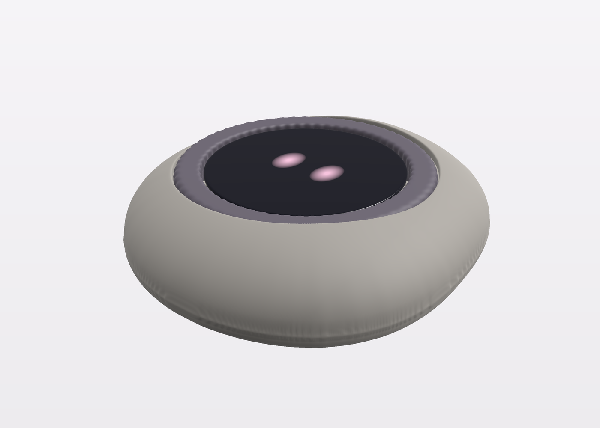
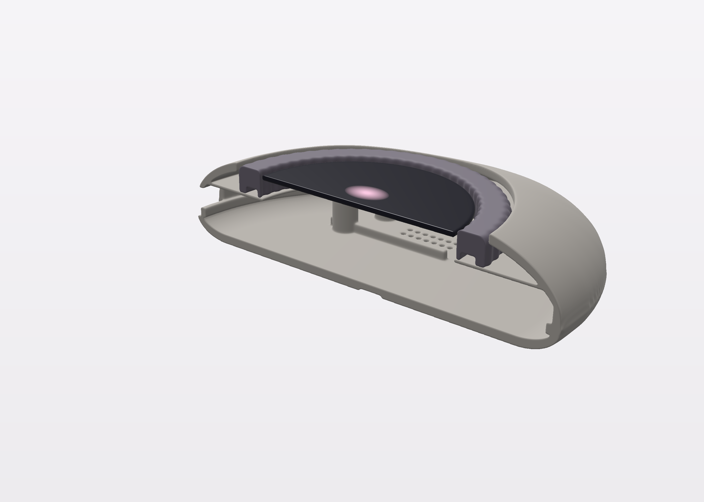
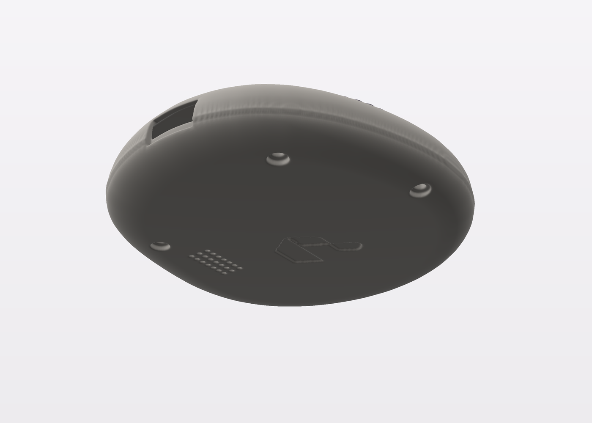
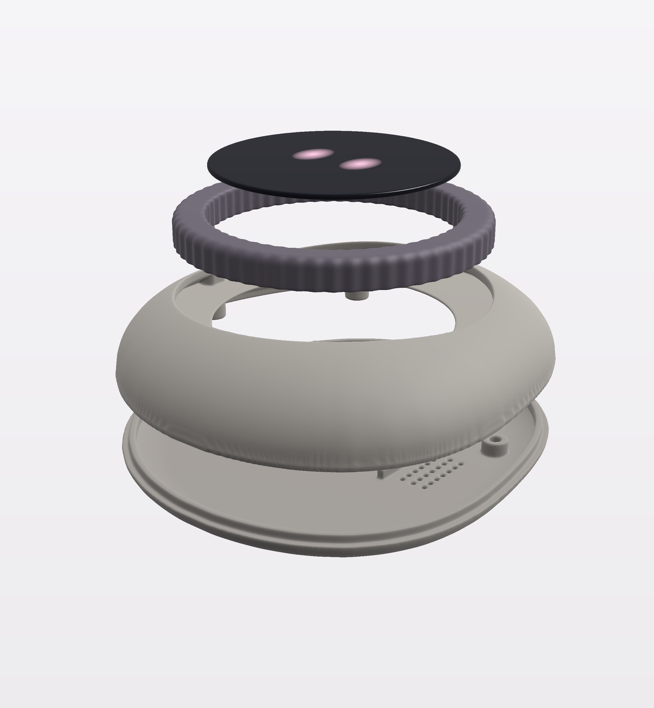

# MAO_MAIN A1: the rock enclosure

Owner decision 2026-10-06: a smooth, slightly irregular, 3D-printable river stone instead of the A0 puck. Concept level: the
outer form, the shells, the fixings and the fit around the A1 stack are modelled and printable; the face carrier is not (see
Open).

| Assembled | Cut-away |
|---|---|
|  |  |
|  |  |

## Form

- **Shape:** one continuous surface with no flats or hard edges. The outline is a circle with low harmonics (2nd 5 %,
  3rd 2.2 %, 4th 1 %, 5th 0.9 %).
- **Offset:** the stone is shifted 2.6 mm left and 2.2 mm down from the dial axis, so it reaches further towards the lower
  left, a nod to the ODD JOBS mark's tail.
- **Height:** an elliptical rim profile, top dome to 21 mm, the underside flat with a 9 mm round-over.
- **Dial and face:** they sit in the top, and the stone's surface beside the ring ranges from 16.5 to 20.6 mm against the
  ring's 19.0, so the dial reads as set into the stone.
- **The mark:** debossed 0.5 mm on the underside (18 mm wide), read the right way from below.
- **Material:** matte PETG for the shells; the ring in TPU 95A.

## Numbers (from `rock.py` `report()`)

| Item | Value |
|---|---|
| Footprint × height | 82.2 × 88.8 × 21.0 mm |
| Wall | 2.0 mm |
| Board Ø58 to the inner wall | ≥ 7.3 mm |
| Cell 35.5 × 30 to the inner wall | ≥ 11.8 mm |
| Dial ring | ID 48 / OD 60 / 6 mm tall, 60 flutes, a 3.2 mm groove at r 26.3 for the 30-pole strip |
| Ring deck | 0.6 mm (z 12.4–13.0), so the strip-to-Hall gap is about 1.6 mm (A0 spec 1.5 mm) |
| Parting line | z 5.0, rabbet: base lip 1.6 mm tall, 0.2 mm clearance |
| Fixing | 3 × M2 heat-set inserts in the top shell at r 32.4, at 0°, 205° and 300° (clear of USB at 270° and the antenna at 90°); screws from below with counterbores |
| Board | located by the two A0/A1 holes on pins from the base posts; held by 4 ribs from the top shell |
| USB-C | a 12.4 × 6.8 mm cable tunnel from the 12 o'clock surface to the port |
| Speaker | 21 × Ø1.1 grille in the base at 9 o'clock |

## Files

All files are in `hardware/mao/enclosure/rock/`.

**Generator:**
- `rock.py`: the parts as voxel fields.
- `export_rock.py`: STL output.
- `render_rock.py`: renders.

**Print files (`stl/`).** Every mesh is closed and a single body (trimesh):

| File | Volume | Print |
|---|---:|---|
| `mao-rock-top-shell.stl` | 9.3 cm³ | face down; supports only in the cable tunnel |
| `mao-rock-base.stl` | 12.7 cm³ | flat, mark side down |
| `mao-rock-ring.stl` | 5.0 cm³ | TPU, groove up |
| `mao-rock-feel-model.stl` | 101.6 cm³ | one solid piece: print it first to judge the size in the hand |

The STL frame is +x right and +y towards 12 o'clock, z up.

## Open

1. **Face carrier:** the face carrier, window mount and the flexures that centre the face over the three switches (P2) are
   not modelled.
2. **IR windows:** the IR LEDs at 11 and 1 o'clock sit behind a thick wall. Use IR-clear PETG or two Ø3 holes.
3. **Antenna:** there is more plastic over the antenna at 6 o'clock than on the puck. Do the RSSI A/B check at bring-up.
4. **Ring retention:** the ring rides the deck, and a retaining clip or lip must stop it lifting off.
5. **Ring damping:** R2 (grease plus a TPU drag ring) needs an O-ring groove, which is not modelled.
6. **Fit print:** the first print is the fit check, as on A0. The mechanical checks so far are numeric only.
