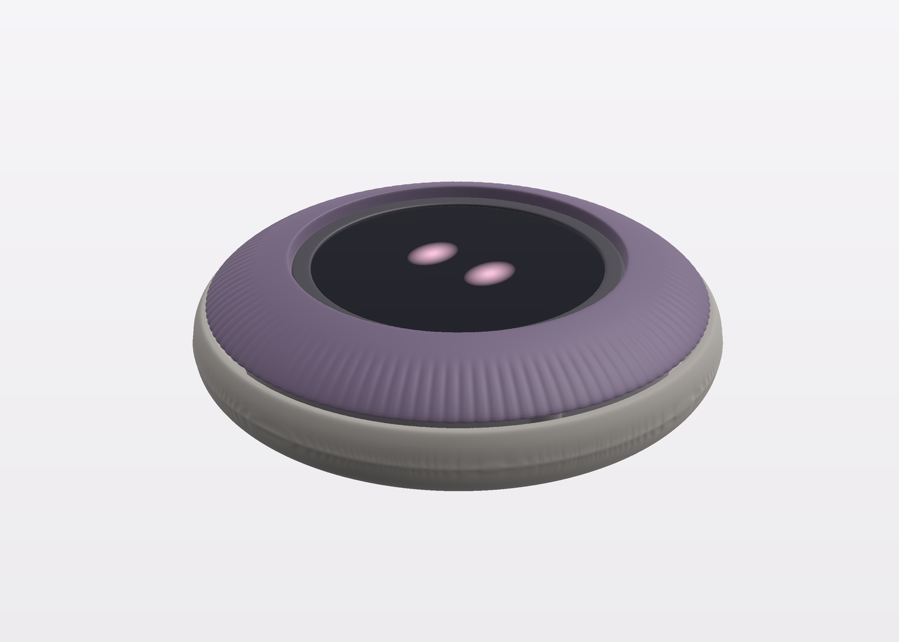
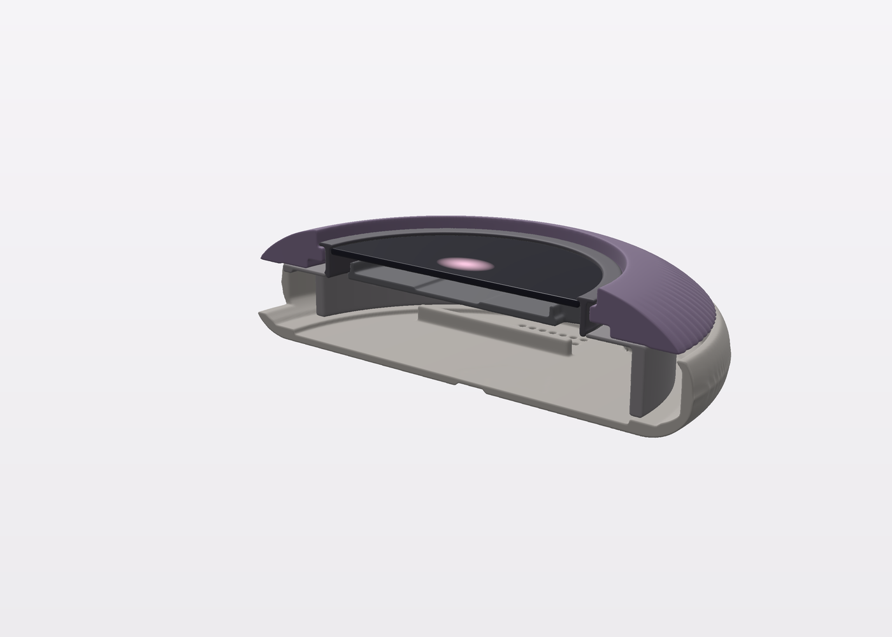
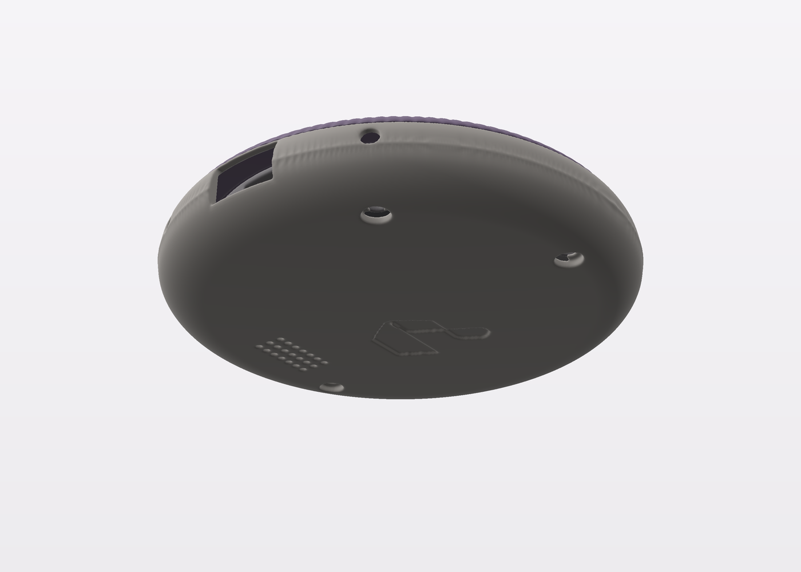
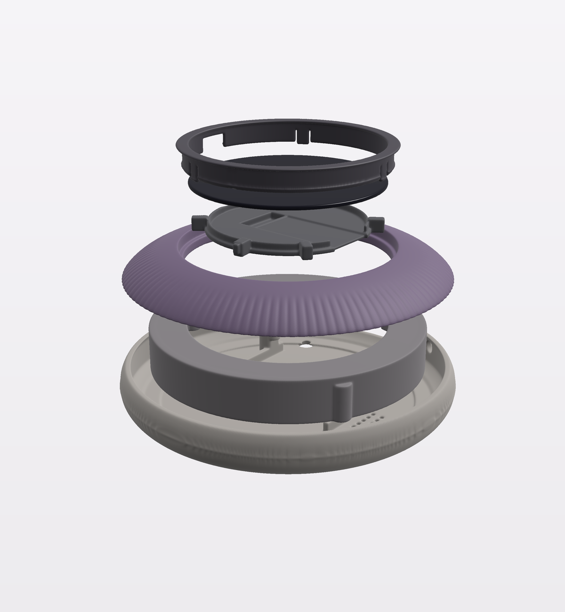
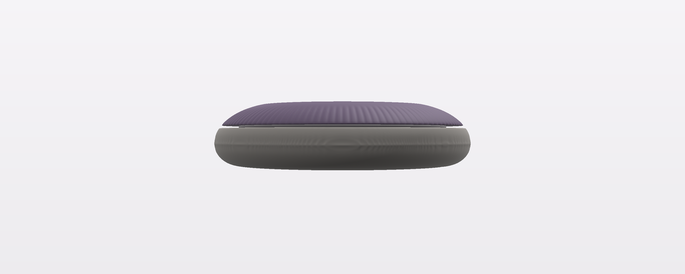
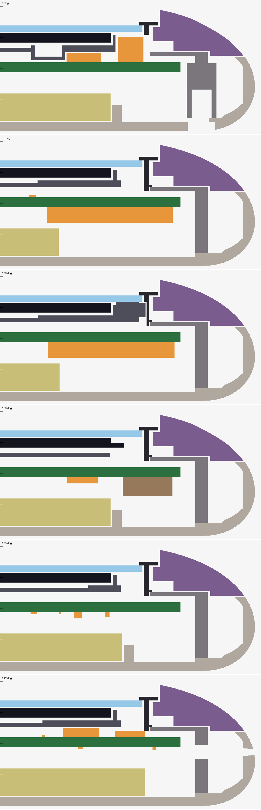

# MAO_MAIN A1: the wheel stone enclosure

Owner decision 2026-10-06: the **wheel stone** replaces the rock as the A1 enclosure direction. The owner found the rock's
small ring not prominent enough. In the wheel stone the whole upper shoulder of a round river stone is the dial: you turn
the stone's top, and the face sits in a shallow well in the middle. The rock (`mao-a1-enclosure-rock.md`) stays in the
tree as the earlier study.

| Assembled | Cut-away |
|---|---|
|  |  |
|  |  |

## Form

- **Size:** Ø82 × 20 mm. The stone is widest at z 7 and has an elliptical shoulder up to the crown, with a flat underside
  and an 8 mm round-over.
- **Dial:** the wheel is everything above z 12. It is 78.9 mm across where it meets the base and 8.2 mm tall at the
  outside, so the thumb turns the stone's own shoulder. 120 shallow grip grooves (0.18 mm) run on the slope only; the top
  stays smooth.
- **Face well:** the bezel lip sits 1.9 mm below the wheel's inner edge. That leaves room to press the face without
  catching the wheel, and to turn the wheel without pressing the face.
- **The mark:** debossed 0.5 mm on the underside (18 mm wide).

## Parts

| Part | Moves | What it does |
|---|---|---|
| base | – | Floor (1.4 mm under the cell, 2 mm elsewhere). It also carries the cell rails, two posts with the board's locating pins (beside the cell, with a collar above it), the USB-C cable tunnel at 12 o'clock, IR windows at 11 and 1 o'clock, the speaker grille at 9 o'clock and the mark. |
| frame | – | A bearing wall round the board and the 0.6 mm deck the wheel rides on, which also passes over the Hall pair. Four ribs hold the board rim down. 3 × M2 heat-set inserts at r 32.4 (0°, 150°, 300°, clear of USB and the antenna), screwed from below through the base. |
| wheel | turns | Solid (11.2 cm³, about 14 g in PETG: a little flywheel). Its flat underside rides the deck with 0.15 mm clearance and carries the 30-pole strip at r 26.3 in a groove open to the bore (the strip is self-adhesive). A skirt hides the joint. The inner edge steps down under the bezel lip, which holds the wheel down. |
| bezel | – | Fitted last. A 0.9 mm tube inside the deck, with a lip that holds the wheel down at its outer edge and stops the window at its inner edge. Three snap tongues (70°, 190°, 300°, where nothing sits under the deck edge) catch 0.55 mm under the deck, and a lead-in on each barb guides it past. A notch clears the IR receiver; a slot takes the carrier's key. |
| carrier | presses | A tray under the panel with three bosses on the switch stems (the even triangle of 2026-10-07), and the tail pocket and the shortened well (x 5.6 … 9.9) from `mechanical.py`. The tail drops at 9 o'clock past the panel's glass ledge. Six posts up to the window sit between the sensors and the tail: none over the IR receiver (3 o'clock), the ToF (≈ 242°) or the tail. A key into the bezel stops it rotating. |
| window | presses | 1 mm clear PMMA disc, Ø45.8, laser cut and bonded to the posts. The switch springs push it up against the lip, with 0.5 mm under the lip. |

The face stack follows the board's: switch stems 1.5 mm, panel rear 2.7 mm and window underside 4.9 mm above F.Cu,
0.25 mm press travel. A 30-pole strip face sits 1.35 mm above the Hall tops, the spec gap being 1.5 mm.

**Assembly:**
1. The panel goes on the carrier and its tail through the board slot into J301.
2. The board goes onto the base pins with the cell below.
3. The frame goes over the board, held by 3 × M2 screws from below.
4. The wheel drops onto the deck.
5. The window is bonded to the carrier posts.
6. The bezel snaps in.

**Opening it:** remove the three screws and lift the base off. The board then comes out from below, which exposes the
barbs.

## Checks (`wheelstone.py`)

- **Clash check, 0 findings at 0.2 mm, at rest and pressed.** Every enclosure part is tested against every other part and
  against the board itself. That covers 107 component bodies (from the board's 3D models and Fab outlines, dumped by
  `board_parts.py`), the cell and the speaker.
  - Anything overlapping by more than 0.06 mm counts. The only designed overlap is the carrier's three bosses on the
    switch stems.
  - A planted fault (the tray lowered 0.7 mm) is caught on Q102 and U402.
- **This review found and fixed three faults in the first wheel-stone draft:**
  - The frame's hub lip blocked fitting the wheel, and nothing held the face in. Both are now retained by the bezel.
  - The face carrier's solid ring sat in the sensors' view and on the IR receiver. It is now posts with gaps.
  - The base posts cut 57 mm³ into the cell.
- **STL export:** every mesh is closed and a single body (trimesh), then decimated to about 0.2 mm where it stays closed.

| Item | Value |
|---|---|
| Size | Ø82 × 20.0 mm |
| Wheel OD at the joint, bore, step under the lip | 78.9 / 49.2 / 51.4 mm |
| Wheel height at the outside | 8.2 mm |
| Face well (wheel inner edge above the lip) | 1.9 mm |
| Strip face to Hall top | 1.35 mm |
| Window | Ø45.8, 0.5 mm under the lip, underside 4.9 mm over F.Cu |
| Snap barb under the deck | 0.55 mm |

## Files

All files are in `hardware/mao/enclosure/wheelstone/`.

**Generator:**
- `wheelstone.py`: the parts as voxel fields, the report and the clash check.
- `board_parts.py`: dumps the board's part bodies to `board_parts.json`. Run it with KiCad's Python and rerun it after
  any placement change.
- `export_wheelstone.py`: STL output.
- `render_wheelstone.py`: renders.
- `section_wheelstone.py`: radial sections with the board drawn in.

**Print files (`stl/`).** The STL frame is +x right, +y towards 12 o'clock, z up.

| File | Volume | Print |
|---|---:|---|
| `mao-wheelstone-base.stl` | 11.4 cm³ | Mark side down; supports under the round-over and in the cable tunnel. |
| `mao-wheelstone-frame.stl` | 4.9 cm³ | Deck down. |
| `mao-wheelstone-wheel.stl` | 11.2 cm³ | Underside down; supports under the 0.75 mm step to the skirt (hidden). |
| `mao-wheelstone-bezel.stl` | 0.9 cm³ | Lip down. Snap tongues: MJF PA12 or PETG, not brittle resin. |
| `mao-wheelstone-carrier.stl` | 1.5 cm³ | Small and precise: SLA resin, posts up. |
| `mao-wheelstone-feel-model.stl` | 83.7 cm³ | One solid piece; print it first to judge size and grip. |

JLCPCB's 3D-printing service covers all of these: MJF PA12 for the bezel and SLA resin for the carrier, in keeping with
the one-supplier sourcing goal. The window is a laser-cut PMMA disc.

## Open

1. **Wheel feel:** the wheel spins freely on PETG-on-PETG. Grease, or a TPU drag ring in the deck, would give damping; it
   is not modelled.
2. **Antenna:** a solid wheel puts more plastic over the antenna at 6 o'clock than the puck did. Do the RSSI A/B check at
   bring-up.
3. **IR windows:** the LEDs at 11 and 1 o'clock fire through Ø3 holes in the base and frame. Check the range against the
   puck.
4. **Snap force:** the 0.55 mm barbs on 3 mm-wide, 0.9 mm-thick tongues (3.75 mm free length) are sized by eye. The fit print decides.
5. **Fit print:** the checks are numeric only. Print the feel model first, then a full set.
