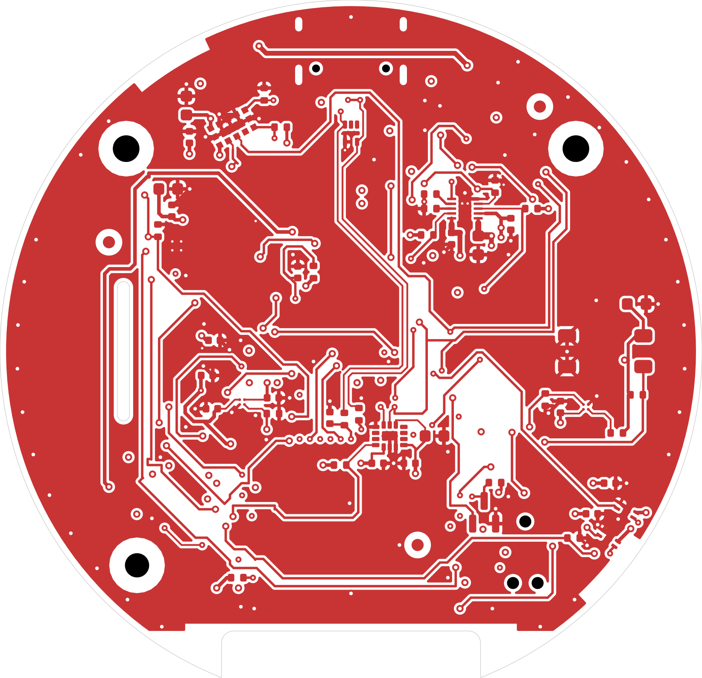
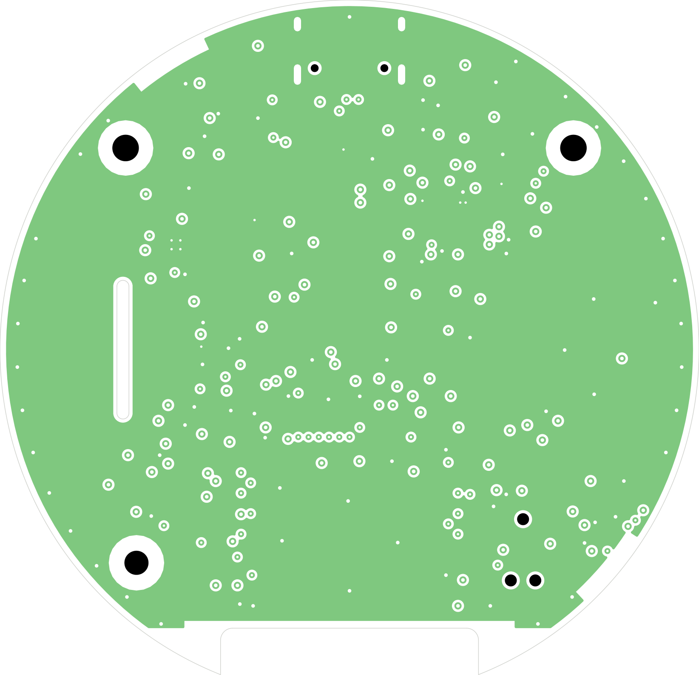
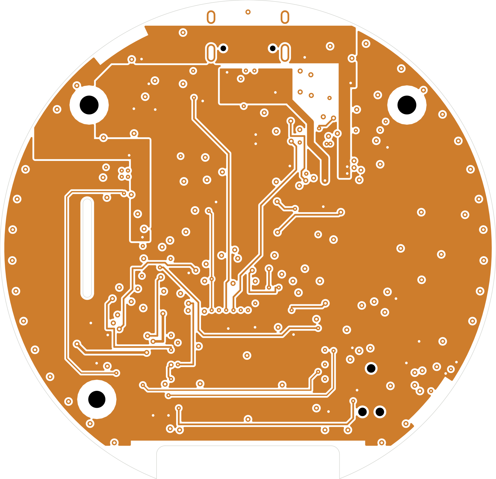
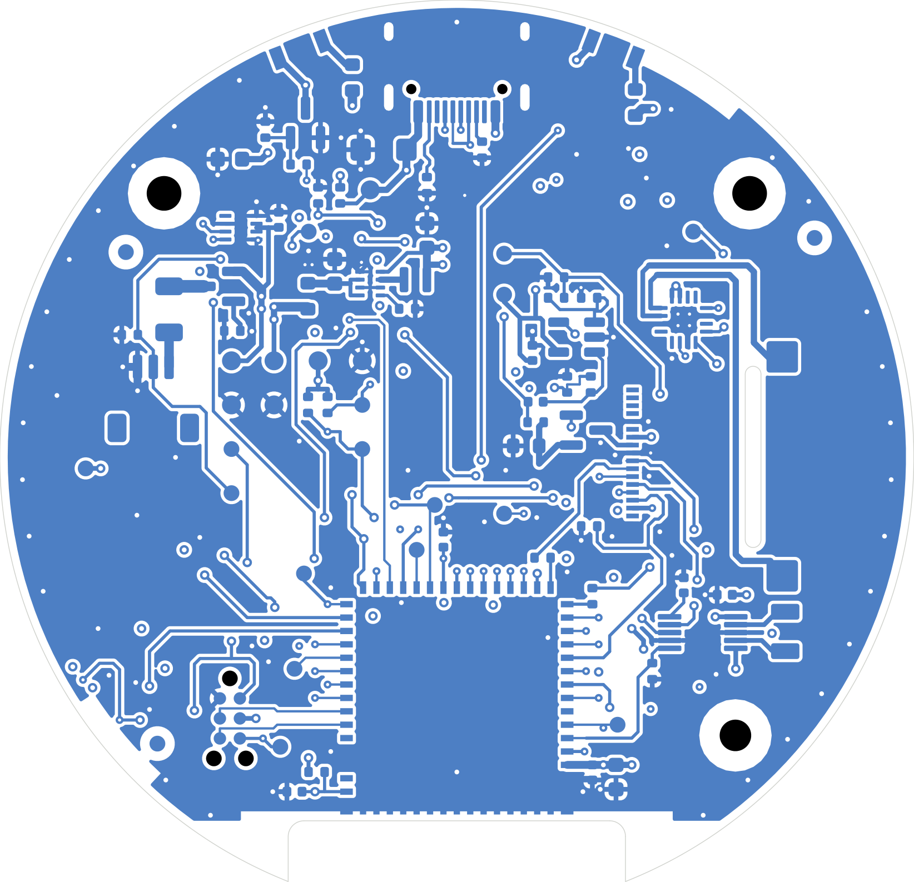
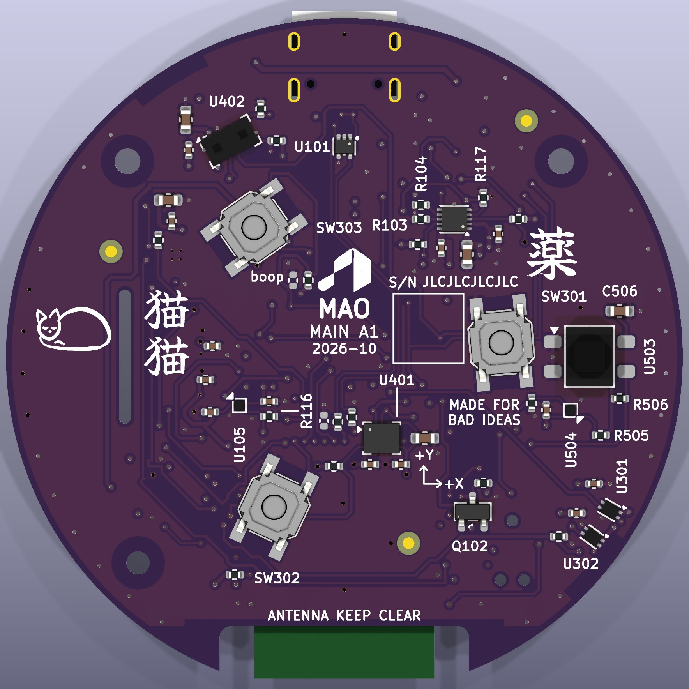
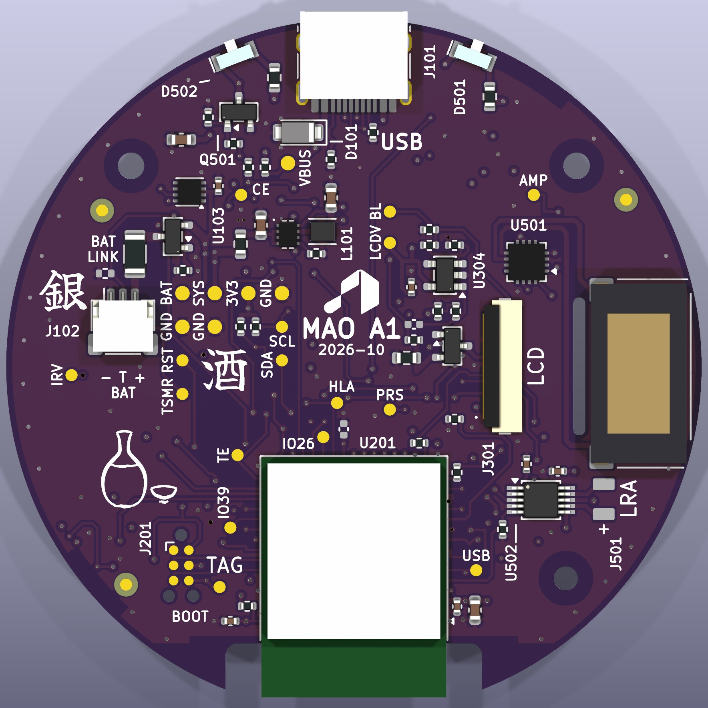

# MAO_MAIN A1 report

MAO_MAIN A0 moved to the M5 Gate C locked architecture ([m5_0_gate_c.md](m5_0_gate_c.md)), 2026-10-06, branch
`feat/mao-main-a1-hw`. A1 keeps A0's round Ø58 mm puck, the ring dial (2 × DRV5012 on a 30-pole ring), the face press
(since 2026-10-06 a tripod of three switches) and the VL53L4CD proximity sensor. Everything is generated from `hardware/mao/design/` by `pipeline.py`.

**Status:** routed, independently reviewed (2026-10-06) and the review's fixes applied surgically (see "Design review
2026-10-06"), then the owner decisions of 2026-10-06 applied surgically (purple mask, tripod face press, kanji eggs:
see "Owner decisions 2026-10-06"); checked on the final files: ERC 0, kicad-cli DRC 0 violations / 0 unconnected / 0 parity, every plane one
piece, silk and mechanical checks 0 findings, fab package written. **Not ready to order:** the owner decisions and Gate D
items under "What still blocks an order" are open, and nothing here is measured.

| L1 F.Cu | L2 In1.Cu: solid GND | L3 In2.Cu: power + slow | L4 B.Cu |
|---|---|---|---|
|  |  |  |  |

| Face (display side) | Back (service side) |
|---|---|
|  |  |

JLC purple mask, white legend, ENIG (renders with the board's stack-up colours).

## What changed from A0, and why

Each item is the owner's A1 brief, traced to Gate C. Parts keep their A0 reference where the function stayed.

| # | A1 | A0 | Gate C reason |
|---|---|---|---|
| 1 | **ESP32-S3-MINI-1-N8** (U201, footprint RF_Module:ESP32-S2-MINI-1, Gate C footprint audit), antenna over the 6 o'clock notch with Espressif's keep-out; 22 µF + 0.1 µF at 3V3, EN 10 k / 1 µF; GPIO0 = BOOT pad only (10 k pull-up, TP8 and the Tag-Connect); GPIO3/45/46 NC | WROOM-1-N8R2, press on GPIO0 | Locked architecture: MCU; "MCU" (no strap on a user switch) |
| 2 | **BQ25185** (U102): ILIM/VSET 18 k = 4.2 V / 500 mA, ISET 1.43 k 1 % = 210 mA (199–220), TS/MR to the cell NTC (DNP 10 k fallback, fixture pad TSMR), /CE GPIO18 + 100 k pull-down, STAT1/2 10 k to +3V3 → GPIO33/34, IN and BAT 2.2 µF 25 V 0402 (≥ 1 µF left after DC bias, design review), SYS 10 µF 25 V. **TPS62840** (U104) at 3.2 V (VSET 102 k 1 %, SLVSEC6D Table 1: 97.92–106.08 k), MODE/STOP GND, EN to VIN, 2.2 µH DFE201612E-2R2M, CIN 4.7 µF, COUT 10 µF; custom DLC0008B footprint; LINK_BAT R108 (1206) and new LINK_REG R122 (0603, SYS → regulator); A0's UVLO divider deleted (BUVLO 3.0 V + firmware floor) | BQ24073 + TPS63802 buck-boost, UVLO divider | Battery / charger; TPS62840; Power domains (measurement links) |
| 3 | **ICM-42670-P** (U401) on the LGA-14 land: AP_AD0 GND (0x68), INT1 → GPIO4 + 100 k pull-up, **INT2 not wired** (coordinator correction b5e3853: GPIO36 is IR_RX), FSYNC GND, AP_CS → VDDIO, VDD 0.1 µF + 2.2 µF X7R, VDDIO 10 nF X7R; silk axes +X/+Y with +Z out of the face (DS-000451 Fig. 4) | LSM6DSOX | Locked: IMU; "IMU" |
| 4 | **DRV2605L on +3V3** (pins 6 and 10), EN GPIO1 + 100 k pull-down, REG 1 µF, VDD 1 µF | DRV2605L on VSYS | Power domains: SDA/SCL/EN abs max VDD + 0.3 V, never gated |
| 5 | **Backlight constant-current sink:** LCD_BL (GPIO8 LEDC) → 32.4 k / 1.0 k → BL_REF; TLV9061 (U304) on 3V3_LCD drives DMG2302UKQ-7 (Q302), Rs 3.3 Ω 1 % (3.2 V × 1.0 / 33.4 = 95.8 mV → 29.0 mA at 100 %) from VSYS to VLED−; gate 100 R + 100 k, LCD_BL 100 k pull-down, DNP 100 pF | AW9364 | Display (sink, not PWM FET) |
| 6 | **TPS22916C** (U105) for 3V3_LCD; LCD_PWR_EN GPIO6, LCD_RST_N GPIO7 (100 k pull-down), TE GPIO35, 22 R on SCLK/MOSI | TPS22919 | Locked: load switches TPS22916 |
| 7 | MAX98357A on VSYS, SD_MODE **directly** from GPIO9 + 100 k pull-down, I2S GPIO40/41/42. **A0's 2.2 k series resistor removed:** its datasheet reason (a logic high above the amplifier's VDD) cannot occur, +3V3 ≤ VSYS by topology | 2.2 k series | Audio |
| 8 | IR receiver supply through a **TPS22916C** (U504) on +3V3, AUX_PWR_EN (GPIO38, see pin swaps) + 100 k; IR_TX GPIO17 + 100 k pull-down; A0's IR12-21C LEDs, AO3400A and IRM-H638T kept | expander-RC | New at Gate C item 1 (receiver on a 3.3 V gate) |
| 9 | ToF: XSHUT GPIO15 + 100 k pull-down, INT GPIO16 (see pin swaps) + 10 k pull-up | expander | Owner brief |
| 10 | Dial: HALL_A GPIO21 (RTC, ext0 wake; see pin swaps), HALL_B GPIO37, HALL_FAST GPIO5 + 100 k pull-down; press PRESS_N GPIO14 + 100 k pull-up (DNP 1 nF), three SKQGAFE010 in parallel (tripod, owner decision 2026-10-06) | press on GPIO0, one SKQGADE010 | Encoder / wake |
| 11 | USB: A0's USB-C, CC 5.1 k, ESD kept (its two channels in the pair's order: pin 3 D−, pin 5 D+); D+/D− one designed pair on F over L2, w 0.15 / gap 0.25 (~90 Ω); 22 R series (R215/R216) near module pins 23/24, DNP 10 pF (C206/C207); VBUS 100 k / 150 k divider → 2N7002 Q102 → **USB_PRESENT_N on GPIO2** (RTC: USB wakes from deep sleep; 100 k pull-up R123); GPIO39 spare | — | USB-C |
| 12 | **Battery connector: JST SH kept (owner decision, below)** | SH clone | Gate C asks for JST PH |
| 13 | Test pads added: BL (TP17), AMP (TP18), TE (TP19), PRS (TP20), HLA (TP21), TSMR (TP22), CE (TP23), USB (TP24, USB_PRESENT_N), spares IO26 (TP25) and IO39 (TP26); A0's named pads kept where their nets exist | — | ODD JOBS 103 |
| 14 | Removed: 4 touch zones + springs, SPH0641 mic, OPT3004, TCA6408A, board-ID divider and their nets; I2C pull-ups 4.7 k (four devices) | — | Owner brief |

### Deviations from the brief

- **Pin swaps forced by routing** (commit e28a367; every `pinmap._self_check()` rule kept, the header and
  `mao-pin-map.md` regenerated by `gen_pinmap.py`): the first A1 layout could not route with the pin map as
  committed, because each line sat on the module side away from its part. PRESS_N GPIO1 → **GPIO14** (RTC, not a
  strap); HAPTIC_EN GPIO14 → **GPIO1** (reset-quiet enable pin); HALL_A GPIO2 → **GPIO21** (RTC: ext0 wake); the
  spare GPIO21 → **GPIO2**; AUX_PWR_EN GPIO16 → **GPIO38** (reset-quiet); TOF_INT_N GPIO38 → **GPIO16**.
- **IMU INT2 not wired** (coordinator: GPIO36 is IR_RX, INT1 carries wake-on-motion).
- **JST PH not fitted:** the PH side-entry housing stands 4.85 mm over B.Cu (KiCad STEP of S3B-PH-K, same housing as
  the SM4-TB) against the 3.2 mm B-side envelope over the cell (`mechanical.py` ZONE_B_MAX_H), and its mated plug
  would sit on the cell. A1 keeps A0's 3-pin SH (1 A per contact) against a worst-case cell current of ≈ 0.95 A:
  **owner decision** (options: a thinner cell / taller base for PH, a 2-contact-per-pole connector, or accept SH
  with the power HAL serialising audio + haptics + IR below 3.7 V, which keeps the real peaks well under 1 A).
- **Reverse-polarity FET Q1 (AO3401A) kept**: it is upstream of the gauge, so it does not move the floor; it drops
  57 / 81 mV (typ / max) at the 950 mA worst event (see floor below).
- **DMG2302UK-7 → DMG2302UKQ-7** (C5224573, the automotive-qualified part, same SOT-23 pinout; JLC stock 990 against
  124): design review 2026-10-06. The Si2302CDS candidate is no longer needed.
- **Fixture/test pad TP8 (BOOT)** moved beside the Tag-Connect's GPIO0 pin; SKQG keep-out and the UART order turned
  the Tag-Connect footprint (J201) by 180°.
- **Face-press tripod is an even triangle** (owner decision 2026-10-07): all three at r 13.5, 120° apart, square-on
  to the centre, with the tail well shortened to clear SW301; see "Owner decisions 2026-10-07".

## Layout notes

- 4 layers (JLC04161H-1080): L2 solid GND; L3 +3V3 default fill with a VSYS band and the VBUS strip, slow lines on
  L3 only outside the power cores (`plane_check.py`: every plane one piece).
- The module sits at the 6 o'clock notch; its top-row and side signals leave through staggered escape vias. I2S
  (3 MHz) is allowed on L3 (`netrules.py` SLOW_OK) because the pin map sends it across the board.
- `route_finish.py` (new pipeline step after the grid router): AMP_LRCLK, which the router cannot join, runs the
  west margin on L3 and crosses the corridor between H3 and the module's escape column on F, so the +3V3 fill keeps
  its direct path from the buck to the module's 3V3 corner; three boxed-in GND resistor pads get their ground.
- `tidy_routes.py` now keeps the 0.3 mm copper-to-edge rule (the display-tail slot is board edge too).
- Design review fixes (2026-10-06): drawn on the committed board by `sync_fields.py --add` (new parts, changed pad
  nets) and `route_review.py` (rip / add per finding); the copper that is topology (USB pair, USB-presence inverter)
  lives in `route_local.py` so a full pipeline re-run draws it before the router.

## Deep-sleep budget

Full table with sources: [mao-power-budget.md](mao-power-budget.md). Wake sources: press (GPIO14, ext1), dial A
(GPIO21, ext0), IMU wake-on-motion (GPIO4, ext1), USB plugged in (USB_PRESENT_N GPIO2, ext1; 0 µA on battery), RTC
timer; every switched rail off by its hardware pull.

| Item | Typ µA | Max µA | Source |
|---|---:|---:|---|
| ESP32-S3 deep sleep, RTC periph on | 8.0 | UNKNOWN (12 used) | ESP32-S3 DS v2.2 Table 5-10 |
| ICM-42670-P wake-on-motion | 4.4 | UNKNOWN (10 used) | TDK product page; not in DS-000451 |
| VL53L4CD HW standby | 5.0 | 7.0 | DS13812 Rev 3 Table 12 |
| DRV2605L EN low | 4.0 | 7.0 | SLOS854D 6.5 |
| 2 × DRV5012 (20 Hz) | 3.2 | 6.6 | SLVSDD5 6.5 (3.0 V) |
| MAX17048 I2C pull-down through 4.7 k | 0.4 | 0.8 | MAX17048 DS |
| 2 × TPS22916C off | 0.02 | 0.2 | SLVSDO5F ISD |
| Q102 2N7002 off (USB_PRESENT_N at 3.2 V) | 0 | 1.0 | CJ 2N7002 IDSS (60 V spec) |
| **+3V3 subtotal** | **25.0** | **44.7** | |
| +3V3 converted (87 % at 3.7 V; worst 80 % at 3.6 V) | 24.9 | 49.7 | SLVSEC6D Fig. 19 |
| TPS62840 IQ | 0.09 | 0.48 | SLVSEC6D 7.5 |
| BQ25185 battery only | 4.0 | 5.0 | SLUSF65B 5.5 IQ_BAT |
| MAX17048 hibernate | 3.0 | 5.0 | 19-6171 Rev 7 |
| MAX98357A shutdown | 0.6 | 2.0 | 19-6779 Rev 7 |
| DMG2302UKQ + AO3400A IDSS | 0 | 2.0 | Diodes DMG2302UK/UKQ, AOS Rev 3.1 |
| PCB / capacitor leakage | 1.0 | 3.0 | allowance |
| **Board total** | **33.6** | **67.2** | |

**33.6 µA typical against the ≤ 35 µA target; the every-maximum stack (67 µA) exceeds the 50 µA hard limit** (as
Gate C's 65 µA did), mainly because two items have no published maximum. The 50 µA limit is a **measurement at
LINK_BAT** on the built board. First levers if it fails: the ToF's supply onto AUX_3V3 (−5 µA), the IMU ODR.

## CORE_3V3 (+3V3) worst case against 750 mA

S3 Wi-Fi TX 355 mA + LRA 150 mA (allowance) + ToF ranging 24 mA + panel 8.5 mA + IMU 0.55 mA + Hall fast 0.74 mA +
TLV9061 0.6 mA + IR receiver 1.2 mA + pull-ups ~2.5 mA = **≈ 543 mA (207 mA margin)**; with Espressif's "supply
≥ 0.5 A" rule for the S3: **≈ 688 mA (62 mA, 8 % margin)**. Nominal +3V3 capacitance 42.4 µF (22 + 10 + 4.7 + 2.2 +
3 × 1 µF + small); with DC bias at 3.2 V the effective value is about 25 µF (typical X5R/X7R derating, not
measured), under Gate C's 40 µF effective limit.

## Low-battery floor (TPS62840 100 % mode, Q1 kept)

`+3V3 = VSYS − I3V3 × (R_HS + DCR + R_LINK_REG)`, `VSYS = VBAT − I_SYS × RON_BAT`; the gauge sees VBAT after Q1.

| Event | Resistances | I3V3 | I_SYS | VBAT at gauge, min | Cell terminal, min |
|---|---|---:|---:|---:|---:|
| worst (TX + LRA + ToF + audio + IR + backlight) | max | 543 mA | 950 mA | **3.56 V** | 3.69 V |
| worst | typ | 543 mA | 950 mA | 3.42 V | 3.50 V |
| TX burst only | max | 390 mA | 420 mA | 3.37 V | 3.43 V |

Q1 drops 57 / 81 mV at 950 mA, ~9 mV at 150 mA. Firmware floor 3.55 V (gauge, loaded), warning 3.65 V, peaks
serialised below 3.7 V; BUVLO 3.0 V is the hardware floor.

## GPIO map

Generated table: [mao-pin-map.md](mao-pin-map.md) (source `pinmap.py`, header
`components/mao_board/boards/main_a1/mao_board_pins.h`).

| GPIO | Net | GPIO | Net | GPIO | Net |
|---:|---|---:|---|---:|---|
| 0 | BOOT pad | 13 | LCD_DC | 34 | CHG_STAT2 |
| 1 | HAPTIC_EN | 14 | PRESS_N | 35 | LCD_TE |
| 2 | USB_PRESENT_N (TP24) | 15 | TOF_XSHUT | 36 | IR_RX |
| 4 | IMU_INT1 | 16 | TOF_INT_N | 37 | HALL_B |
| 5 | HALL_FAST | 17 | IR_TX | 38 | AUX_PWR_EN |
| 6 | LCD_PWR_EN | 18 | CHG_CE_N | 39 | spare (TP26) |
| 7 | LCD_RST_N | 19/20 | USB D−/D+ | 40/41/42 | AMP_BCLK/LRCLK/DIN |
| 8 | LCD_BL | 21 | HALL_A | 43/44 | UART TX/RX (Tag-Connect) |
| 9 | AMP_SD | 26 | spare (TP25) | 47/48 | I2C SDA/SCL |
| 10/11/12 | LCD_CS/MOSI/SCLK | 33 | CHG_STAT1 | 3, 45, 46 | NC (straps) |

## Check results (final files)

| Check | Tool | Result |
|---|---|---|
| ERC | `build_sch.py` (kicad-cli) | **0** violations; 102 fitted + 5 DNP parts of 142, 76 nets |
| DRC | `review.py drc` (kicad-cli `--severity-all --schematic-parity --refill-zones`) | **0** violations, **0** unconnected, **0** schematic parity |
| Planes | `plane_check.py` | GND (L2) 1 piece / 92 vias, VBUS 1, VSYS 1, +3V3 (L3) 1 piece / 27 vias; no necks in GND or the rail regions (the +3V3 mesh round the L3 slow lines has parallel paths, reported only) |
| Silk text | `check_silk_text.py` | 77 texts, **0** findings; 107 references on Fab only (R/C by policy); the kanji are filled polygons (not text), placed off pads, bodies, silk and vias by `silk.py`, stroke widths by `kanji.py` (below) |
| Mechanical | `mech_check.py` | 142 parts, **0** findings; tallest on B: LS501 3.30 mm (speaker pads' body model), J101 3.20, J102 2.96, U201 2.50; F: U503 4.00 under the window, SW301–SW303 1.50 (the tripod, by design), Q102 1.2 mm under the panel (limit 1.2); no part under the tail well |
| Stack-up | `stackup.py`, `stackup_check.py` | JLC04161H-1080, 1.518 mm, purple mask; L3/L4 broadside 16.7 mm (14 pairs, slow lines; new with the tripod: PRESS_N over BL_FB 1.27 mm and over +3V3 1.24 mm); 30 perimeter GND vias, largest gap 69° (the antenna notch); module GND pins 1 / 40 / 41 at 1.0 / 1.97 / 1.31 mm from a via; 3 decoupling GND pads 1.6-2.5 mm from a via (C102, C502, C504; C105 now within 1.6 mm); closest SMD pads to the edge 0.30 mm (IR LEDs D501/D502 at the rim, by design) |
| Fab | `fab.py` | gerbers 12 files, drill 4, BOM 49 lines / 102 parts (every line with LCSC number and sourcing status), CPL 102 rows, assembly drawings, FAB-NOTES and README (JLC purple mask, white legend, ENIG) |
| Kanji | `kanji.py` | 5 words and 2 drawings pass: a 0.16 mm disc opening loses < 2 % ink, closing adds < 5 % (`outputs/KANJI-CHECK.json`) |
| Firmware | `tools/idf.ps1` | `s3-dev` and `dev` (C3) build, 0 warnings (after the owner decisions; no firmware change); host 188 checks / 0 failures, character invariants 51 runs, harness 36 runs identical |

Reproducibility: the grid router is not deterministic between runs (process-dependent ordering); the release
board is router pass 10 (79 of 80 nets) plus `route_finish.py`, the clean-up passes and the design review's
`sync_fields.py --add` + `route_review.py` (whose rip lists match only this board). One re-run of
`pipeline.py route` gave 77 of 80, so after a fresh route the finish step's LRCLK geometry may need re-drawing;
the committed board file, not a re-run, is the reference.

## Sourcing (JLCPCB / LCSC, checked 2026-10-06)

Owner rule: every part preferably from JLCPCB/LCSC. **Order the board as JLC Standard PCBA**: the two 0.4 mm-pitch
WCSP load switches (U105, U504) and parts on both sides are outside Economic PCBA. Status per BOM line is also in the JLC BOM CSV
(`outputs/fab/BOM-MAO_MAIN_A1-JLC.csv`, columns JLC Part Type / Stock / Note) and in `design/sourcing.py`.

| Designator | Value | LCSC | MPN | JLC type | JLC stock | Note |
|---|---|---|---|---|---:|---|
| C101,C103 | 2.2uF 25V | C307418 | CL05A225KA5NUNC | Extended | 897,637 | no Basic/Preferred 2.2u 25 V 0402 in the JLC library (review 2026-10-06) |
| C102 | 10uF 25V | C96446 | CL10A106MA8NRNC | Basic | 3,300,000 |  |
| C104,C202,C301,C303,C304,C305,C306,C40… | 100nF 16V | C1525 | CL05B104KO5NNNC | Basic | 22,000,000 | LCSC shop stock 0 on 2026-10-06; JLC assembly stock fine |
| C105,C404,C506 | 4.7uF 16V | C19666 | CL10A475KO8NNNC | Basic | 2,500,000 |  |
| C106,C501,C505 | 10uF 10V | C19702 | CL10A106KP8NNNC | Basic | 10,300,000 |  |
| C109,C110,C203,C503,C504,C508 | 1uF 25V | C52923 | CL05A105KA5NQNC | Basic | 8,300,000 |  |
| C201 | 22uF 6.3V | C59461 | CL10A226MQ8NRNC | Basic | 8,000,000 |  |
| C402 | 10nF 50V | C15195 | CL05B103KB5NNNC | Basic | 3,900,000 |  |
| C408 | 2.2uF 10V | C100082 | CL10B225KP8NNNC | Extended | 354,360 | no Basic 2.2u X7R 0603 (Basic C23630 is X5R) |
| D101 | SMF15A | C123802 | SMF15A | Extended | 61,610 |  |
| D501,D502 | IR12-21C | C53672 | IR12-21C/TR8 | Extended | 12,341 |  |
| J101 | USB-C | C165948 | TYPE-C-31-M-12 | Extended | 420,357 |  |
| J102 | BAT | C7430445 | ZX-SH1.0-3PWT (JST SM03B-SRSS-TB compatible) | Extended | 90,750 | JST SH-compatible 3-pin (battery) |
| J301 | LCD | C2919497 | 0.5K-HX-18PWB | Extended | 16,270 | listed as HDGC 0.5K-HX-18PWB (same part) |
| L101 | 2.2uH | C337893 | DFE201612E-2R2M=P2 | Extended | 33,137 |  |
| Q101 | AO3401A | C15127 | AO3401A | Basic | 814,915 |  |
| Q102 | 2N7002 | C8545 | 2N7002 | Basic | 1,576,966 |  |
| Q302 | DMG2302UKQ | C5224573 | DMG2302UKQ-7 | Extended | 990 | DMG2302UKQ-7: the automotive-qualified DMG2302UK-7 (C460977, 124 left), same SOT-23 pinout |
| Q501 | AO3400A | C20917 | AO3400A | Basic | 953,963 |  |
| R101,R102 | 5.1k | C25905 | 0402WGF5101TCE | Basic | 5,900,000 |  |
| R103 | 1.43k | C163483 | RC0402FR-071K43L | Extended | 9,576 | no Basic 1.43k 0402 |
| R104 | 18k | C25762 | 0402WGF1802TCE | Preferred Extended | 468,801 | no Basic 18k 0402 |
| R108 | 0R | C17888 | 1206W4F0000T5E | Basic | 2,600,000 |  |
| R109,R118,R119,R201,R202,R401,R506 | 10k | C25744 | 0402WGF1002TCE | Basic | 21,500,000 |  |
| R111 | 102k | C2933066 | FRC0402F1023TS | Extended | 177,764 | no Basic 102k 0402 |
| R116,R117,R120,R123,R207,R208,R209,R21… | 100k | C25741 | 0402WGF1003TCE | Basic | 8,200,000 |  |
| R121 | 150k | C25755 | 0402WGF1503TCE | Preferred Extended | 270,669 | no Basic 150k 0402 |
| R122 | 0R | C21189 | 0603WAF0000T5E | Basic | 23,600,000 |  |
| R213,R214 | 4.7k | C25900 | 0402WGF4701TCE | Basic | 15,400,000 |  |
| R215,R216,R301,R302 | 22R | C25092 | 0402WGF220JTCE | Basic | 4,600,000 |  |
| R312 | 32.4k | C26974 | 0402WGF3242TCE | Extended | 37,795 | no Basic 32.4k 0402 |
| R313,R314 | 1.0k | C11702 | 0402WGF1001TCE | Basic | 7,000,000 | LCSC shop stock 0 on 2026-10-06; JLC assembly stock fine |
| R315,R503,R505 | 100R | C25076 | 0402WGF1000TCE | Basic | 4,000,000 | LCSC shop stock 0 on 2026-10-06; JLC assembly stock fine |
| R317 | 3.3R | C22979 | 0603WAF330KT5E | Extended | 280,671 | no Basic 3.3R 0603 |
| R501,R502 | 56R | C25196 | 0603WAF560JT5E | Preferred Extended | 1,070,000 | no Basic 56R 0603 |
| SW301,SW302,SW303 | SKQGAFE010 | C202424 | SKQGAFE010 | Extended | 24,977 | face tripod, 3 per board (owner decision 2026-10-06) |
| U101 | TPD2E2U06 | C1972959 | TPD2E2U06DRLR | Extended | 7,569 |  |
| U102 | BQ25185DLHR | C19725033 | BQ25185DLHR | Extended | 3,623 |  |
| U103 | MAX17048G+T10 | C2682616 | MAX17048G+T10 | Extended | 25,799 |  |
| U104 | TPS62840DLCR | C2071859 | TPS62840DLCR | Extended | 3,882 |  |
| U105,U504 | TPS22916CYFPR | C2680319 | TPS22916CYFPR | Extended | 77 | LOW STOCK (2 per board, enough for the 5-unit build); 0.4 mm WCSP: order JLC Standard PCBA. Fallback TPS22916BYFPR C2150095 (21,486): fast rise, check the 3V3_LCD / AUX_3V3 inrush |
| U201 | ESP32-S3-MINI-1-N8 | C2913206 | ESP32-S3-MINI-1-N8 | Extended | 6,018 |  |
| U301,U302 | DRV5012AEDMRR | C2655038 | DRV5012AEDMRR | Extended | 5,226 |  |
| U304 | TLV9061IDBVR | C398358 | TLV9061IDBVR | Extended | 289,451 |  |
| U401 | ICM-42670-P | C3288646 | ICM-42670-P | Extended | 6,692 |  |
| U402 | VL53L4CDV0DH/1 | C3178291 | VL53L4CDV0DH/1 | Extended | 11,527 |  |
| U501 | MAX98357AETE+T | C910544 | MAX98357AETE+T | Extended | 25,277 |  |
| U502 | DRV2605LDGST | C425927 | DRV2605LDGST | Extended | 858 | DRV2605LDGST: the DGSR part on a 250-piece reel (review 2026-10-06) |
| U503 | IRM-H638T/TR2 | C91447 | IRM-H638T/TR2 | Extended | 177,048 |  |

**All ten Gate C ICs are on LCSC and JLC-assemblable (Extended).** No locked part had to be substituted.

### Bought separately — LCSC (not assembled)

| Item | LCSC | MPN | Maker | Qty | Status |
|---|---|---|---|---:|---|
| Display 1.28in round GC9A01 IPS, 18-pin FPC (J301) | UNKNOWN | WF0128BTYAA4DNN0 (Gate C) | Winstar | 1 | not on LCSC. Closest LCSC listing C17215183 PG1301HA-ZA0 (Pacific Goal, GC9A01): stock 0, pinout/TE/backlight/FPC UNKNOWN - owner decision |
| LRA 8 mm coin, wire leads (J501) | C2682305 | LD0832AA-0099F | LEADER | 1 | JLC stock 1,093; 1.8 V, 80 mA; resonant frequency UNKNOWN (DRV2605L auto-resonance tracks it); alternatives C2942349 LD0832AA-0126F (107), C5632413 LD0825BC-0168F (41) |
| Speaker 15 x 8 mm, 8 ohm, spring contacts (LS501) | C20181964 | CMS-150803-088S-X8 | CUI | 1 | JLC stock 14 (very low); no alternative found on LCSC |
| LiPo cell LP503035 class, 500 mAh, with PCM and 10k NTC | UNKNOWN |  |  | 1 | not found on LCSC - owner decision (buy outside LCSC) |
| Battery housing, JST SH 1.0 mm 3-pin | C268100 | SHR-03V-S-B | JST | 1 | stock 5,786; mates the SH-compatible header C7430445 on the board (fit of genuine JST to the clone: check) |
| Battery crimp contacts, SH | C189897 | SSHL-002T-P0.2 | JST | 3 | stock 841,495; or pre-crimped cable C54529088 SH1.0-3P-1-100(3)-28A (HanElectricity, 865; wiring UNKNOWN) |
| LRA / speaker leads | none needed |  |  | 0 | the LRA wires solder to the J501 pads, the speaker springs press on the LS501 pads |

## Open risks

1. **Battery connector (owner decision):** SH (1 A per contact) kept; the worst-case cell current is about 0.95 A
   unless the power HAL serialises the peaks. PH does not fit the 3.2 mm B-side envelope.
2. **Deep sleep:** 33.6 µA typical leaves 1.4 µA to the 35 µA target; the all-maximum stack is 66 µA (over 50 µA).
   The S3 and the ICM-42670-P wake-on-motion have no published maximum. Only a LINK_BAT measurement settles it.
3. **+3V3 margin:** 62 mA (8 %) with Espressif's 0.5 A rule; the LRA current is an allowance (part not chosen).
4. **Low-battery floor** 3.55 V (gauge, loaded) rests on the TPS62840 R_HS at 3.6 V (no lower-VIN value from TI).
5. **Panel VCI:** +3V3 is 3.2 V nominal against the panel's 3.3 V maximum; Winstar data still missing (the
   backlight Rs 3.3 ohm waits on the LED data; TE drive type unknown).
6. **Supply:** TPS22916CYFPR 77 in JLC stock with 2 per board (enough for the 5-unit build; kept for its slow rise
   and quick output discharge; fallback TPS22916BYFPR C2150095, 21,486 in stock, rises fast: check the 3V3_LCD /
   AUX_3V3 inrush before using it), DRV2605LDGST 858 (was DGSR 82), DMG2302UKQ-7 990, speaker 14. The TPS22916C is a
   0.4 mm-pitch WCSP-4: order JLC Standard PCBA.
7. **Sourcing gaps:** the Gate C panel and an LP503035 cell with PCM + NTC are not on LCSC (UNKNOWN); the closest
   LCSC panel (C17215183) has 0 stock and an unknown pinout. The LRA's resonant frequency is unknown.
8. **IMU axes:** silk follows DS-000451 Fig. 4; firmware confirms the map at bring-up (+1 g on Z, face up).
9. **Routing:** I2S runs on L3 (SLOW_OK) and the word clock takes a long detour round the west margin; uncritical
   at these rates but untested. Router non-determinism (above).
10. **Thermal:** BQ25185 0.57 W worst case on F under the panel; A0's thermal-camera check stays.
11. **Land patterns:** MAX98357A and the MAX17048 EP remain on Gate C's unverified list; DLC0008B is a custom
    footprint from TI's land example.

## What still blocks an order

- Owner decisions: battery connector (SH vs PH), the panel source (not on LCSC), the cell (not on LCSC).
- Gate D items carried from Gate C: a panel sample and its data (Rs, VCI, TE), the LRA and speaker chosen, the
  enclosure (fold, FPC length, heights), the physical S3 wake test, the pull test, a current meter for the 50 µA proof.
- Supply confirmation for the TPS22916C (77 in stock, 2 per board); the order as JLC Standard PCBA (0.4 mm WCSP).
- Land-pattern freeze (MAX98357A, MAX17048 EP, DLC0008B) against the manufacturers' drawings.
- The design review's open items (below).

## Design review 2026-10-06

An independent review of the routed A1 found the items below. Each fix was drawn on the committed board (the grid
router is not deterministic): `circuit.py` / `pinmap.py` changes, `sync_fields.py --add` for new parts and pad nets,
`route_review.py` for the copper; then ERC, DRC, plane, silk, mechanical and stack-up checks on the final files.

| # | Finding | Done | Still open |
|---|---|---|---|
| 1 | **USB could not wake A1 from deep sleep**: VBUS_SENSE was on GPIO39, not an RTC pad. (The software half, "never deep-sleep with USB present", was fixed before, 14238c1.) | The 100 k / 150 k VBUS divider now drives a **2N7002 (Q102, C8545 Basic)**; its drain, **USB_PRESENT_N** (100 k pull-up R123 to +3V3, 33 µA only while USB is present, 0 µA on battery), is the spare RTC pad **GPIO2** (`pinmap.py`: `od`, R, ext1 any-low; every `_self_check` rule kept, spares GPIO26/39/43/44). Q102/R123 sit on F east of the module's right escape column, gate on the router's VBUS_SENSE line; the drain line runs on L3 under the module, south of AMP_LRCLK, to GPIO2's stub and TP24 (renamed USB). GPIO39 is a spare with test pad TP26 (IO39). 2N7002: VGS(th) ≤ 2.5 V at 250 µA against ≥ 2.85 V of gate at the USB minimum 4.75 V; VGS 20 V max, so a faulty source up to 33 V leaves the gate intact. Firmware: `MAO_LINE_USB_PRESENT` reads GPIO2 active low; USB_PRESENT_N joins the ext1 any-low mask when it idles high (DEV deep sleep and the critical sleep ask for it); MAO still never deep-sleeps with USB present. | The deep-sleep USB wake and the 2N7002's threshold margin at a sagging 4.4 V source are bring-up tests. |
| 2 | **C101 (charger IN) and C103 (BAT) 1 µF 0402** keep well under 1 µF at 5 V / 4.2 V DC bias (TI SLUSF65B 7.2.2.3 asks ≥ 1 µF). | Both **2.2 µF 25 V 0402 X5R** (CL05A225KA5NUNC, C307418, Extended, 897,637; the JLC library has no Basic/Preferred 2.2 µF 25 V 0402). Same footprint. | The effective value is the vendor's bias curve, not measured. |
| 3 | **USB D+/D− not a pair**: D+ on F, D− down B (x 0.2) across the L3 VBUS / +3V3 split under the receptacle. | One designed pair on F over the solid L2 ground, **w 0.15 / gap 0.25 mm: ~91 Ω differential bare, ~88 Ω under the mask** (Hammerstad-Jensen microstrip with the IPC-2141 coupling term, h 0.0764 mm, εr 4.1, 35 µm; `project.py` diff-pair rules updated): from the receptacle's F join (D+) and one D− via west of it, in line through the ESD array (its two identical channels swap: pin 3 D−, pin 5 D+), round the face switch's east side, into R216/R215. D+ 34.4 mm on F (+1.1 mm B contact stubs), D− 31.7 mm on F (+3.9 mm B stubs and join, all over the VBUS strip, no split crossed). Room for it: the I2C data line turns 0.35 mm earlier, the I2C clock's B→L3 via north of the 22 R moves 0.9 mm. | No impedance coupon or control ordered (FS USB does not need it). The module-side USB_DP/DN links (~3 mm) are unchanged. |
| 4 | **VBUS to U102 a 0.4 mm L3 track**. | **0.8 mm** on L3, re-drawn 0.3-1.7 mm east to clear its neighbours (VBUS_SENSE's L3 run moved 0.35 mm east under the buck); the F link from the via to C101 / U102.10 0.4-0.5 mm (0.3 mm for the last 0.5 mm into the 0.2 mm pin). | One 0.6 / 0.3 mm via carries the 500 mA input limit (no site for a second beside R122 on B). |
| 5 | **U102 (BQ25185) exposed pad without vias in it**. | Two 0.5 / 0.2 mm GND vias in the pad's south half (TI's layout example), plus its existing via just outside. | The north half sits over LINK_REG R122 on B: no third/fourth via there. Via-in-pad: POFV if JLC offers it, else tented (FAB-NOTES). |
| 6 | **U104 (TPS62840) GND pins and C105's GND without vias; one +3V3 via at the module's 3V3 pin**. | One 0.5 / 0.2 mm GND via 0.6 mm from GND pin 1, on F between R103/R104's ground pads and on B joined to the ground web of pins 1/3/6 and C105.2 (1.8 mm of 0.3 mm track; C105 now within 1.6 mm of a via). A second +3V3 plane via on the module's 3V3 track between C202 and C201 (0.8 mm from C201.1). | No site for a via at pins 3/6 or at C105.2 itself (REG_IN, REG_SW, VSET, R118 / IR_TX copper and the L3 VBUS feed box them in; `gnd_pad_vias.py` finds none either). |
| N3 | LCD_TE (GPIO35) floats while the panel rail is off. | Firmware: internal pull-down from reset and whenever the rail goes off, held through deep sleep, released at rail-up. | — |
| N5 | On USB power (VSYS 4.5 V) the MAX98357A could drive the 0.8 W speaker past its rating if the gain is tuned up. | `mao_board_audio_gain()` never exceeds **0.70**: full-scale sine 2.1 dBV + 9 dB = 3.59 Vrms; 0.70 × 3.59 = 2.51 Vrms = **0.79 W into 8 Ω** (today's 0.58: 2.08 Vrms, 0.54 W). | Loudness by ear at bring-up, below the ceiling. |
| N7 | Backlight arithmetic: the docs said 94.6 mV / 28.7 mA. | 3.2 V × 1.0 / 33.4 = **95.8 mV → 29.0 mA** in the capture notes, this report and the power budget. | Rs waits on Winstar's LED data (unchanged). |
| — | Sourcing (owner: LCSC/JLC). | DRV2605LDGSR → **DRV2605LDGST** (C425927, same part, 250 reel, 858 in stock); DMG2302UK-7 → **DMG2302UKQ-7** (C5224573, same pinout, 990). TPS22916CYFPR kept (slow rise + QOD; 77 in stock covers the 5-unit build; fallback TPS22916BYFPR C2150095, fast rise: check inrush). **Order as JLC Standard PCBA** (0.4 mm WCSP). | — |

New parts: Q102 2N7002 (F), R123 100 k (F), TP26 (B). BOM 49 lines / 100 fitted parts (was 47 / 98).

## Owner decisions 2026-10-06

Applied surgically to the committed board (the router is not deterministic), each recorded in the design scripts.

### 1. Face press: tripod (P2)

| Item | Value |
|---|---|
| Part | ALPS **SKQGAFE010**, LCSC **C202424**, JLC Extended, **24,977** in stock (2026-10-06); ALPS: 0.98 N, travel 0.25 mm, height 1.5 mm with stem, 500,000 cycles, "Standard" status. One part number for all three; same footprint as A1's SKQGADE010 (KiCad `SW_SPST_SKQG_WithStem` and its 3D model) |
| Circuit | SW301 / SW302 / SW303 in parallel on PRESS_N (GPIO14, 100 k pull-up R318, DNP C308); no pin or firmware change |
| Positions | Superseded on 2026-10-07 by the even triangle (below). Were: SW301 70°, r 17.6; SW302 190°, r 14.5; SW303 310°, r 14.5 |
| Force | Even triangle: centre press shares 34 / 32 / 34 %, the three click together at ≈ 2.9 N (≤ 4 N); over a switch ≈ 1 N plus the flexures |
| Mechanics | Three Ø2 bosses on the carrier reach 1.2 mm below the panel's rear plane onto the stems; the flexures only centre the face (roots at 10° / 130° / 250°); see [mao-mechanical.md](mao-mechanical.md) §4 |

**Why the radii are not equal:** 120° spacing puts one switch in the 3 o'clock half of the panel area, and from 21° to
171° every spot at r 14–16 mm collides with something that cannot move: the charger (21–55°), the carrier's tail
well (57–123°, a mechanical keep-out), the IR receiver's courtyard (≈ 90°: 4.8 mm between it and the well for a
5.8 mm courtyard), Q102 / R123 (126–147°) and FID2. The one pocket a 5.2 mm switch with its keep-outs fits is at
70°, r 17.6, between the well, the receiver and the charger's BAT capacitor, still under the panel's rim (r 17.8). An
equal-radius tripod at r ~15 would have meant re-routing the USB pair, the charger's corner and the panel's SPI bus.
The other two switches sit at r 14.5 where the F routing leaves them room. **Owner check:** accept the unequal radii,
or ask for an equal-radius tripod with that larger re-route.

**Copper** (`route_tripod.py` place / rip / add, recorded so a re-run on the pre-tripod board reproduces it):
SW301 moved, SW302 / SW303 added (`sync_fields.py --add`); the single switch's leg joins removed (also from
`route_local.py`); the I2C pair runs through SW301's channel between its keep-outs; PRESS_N reaches SW301 on L3
from the old trunk via, SW302 straight down from the module pin's via, SW303 along y −5.95 into R318's line;
IMU_INT1, AMP_BCLK and HALL_FAST step round SW302; 3 GND vias added, 2 stitching vias in keep-outs removed. The
SKQG's paired legs are one contact inside the part, so they are marked jumpered (`build_pcb.JUMPERED_LEGS`) and one
leg per contact carries copper. The maker mark and the S/N field moved to clear spots under the panel (`silk.py`
searches them now).

### 2. Solder mask: purple

Stack-up F.Mask / B.Mask colour "Purple", silk white, ENIG (`stackup.py`); FAB-NOTES and the new
`outputs/fab/README.txt` say JLC purple mask, white legend, ENIG; the Gerber job file carries it. All eight renders
were regenerated with `--use-board-stackup-colors` (same views and sizes as before); the layer plots are copper
only (regenerated for the tripod copper).

### 3. Easter eggs: kanji and two ink drawings

The A0 line art (sleeping cat, paws, zzz) and "9 lives" / "meow" are gone (`eggart.py` removed); "boop" stays by a
face-press switch (SW303) and "MADE FOR BAD IDEAS" under the panel. Brush-calligraphy kanji from **Yuji Syuku**
(SIL OFL 1.1; `hardware/mao/brand/YujiSyuku-Regular.ttf` + `OFL-YujiSyuku.txt`) as filled silk polygons:
`kanji.py` merges each glyph's overlapping strokes (skia-pathops), traces them into `brand/kanji-eggs.json` and
checks them; `silk.py` places them (mirrored on B); pipeline step `kanji` before `silk`.

| Word | Meaning | Side, where (centre mm) | em mm | Size mm | Opening loss | Closing gain |
|---|---|---|---:|---|---:|---:|
| 猫猫 | Maomao, "cat cat" | F, under the panel by the face press and "boop" (−3.6, −14.4) | 4.0 | 7.8 × 3.4 | 1.94 % | 2.5 % |
| 銀 | silver | B, by the BAT LINK 0R R108 (24.3, −6.6) | 4.0 | 4.0 × 3.5 | 1.37 % | 4.5 % |
| 薬 | medicine | F, by the BQ25185 charger, under the window border / ring lip (21.8, −12.6) | 5.0 | 4.3 × 4.6 | 1.94 % | 4.2 % |
| 酒 | sake | B, under the cell (11.5, 0.8) | 4.4 | 3.8 × 3.5 | 1.84 % | 1.6 % |
| 毒見 | poison tasting | B, under the speaker, top to bottom (−24.8, 0.6) | 4.4 | 4.2 × 8.4 | 1.06 % | 4.8 % |
| (drawing) | the sleeping cat with its z's | F, nearest 猫猫 where it fits whole (−14.2, 9.8) | – | 9.2 × 6.8 | 1.12 % | 1.6 % |
| (drawing) | a sake bottle and cup | B, beside 酒 (17.9, 8.6) | – | 6.4 × 6.5 | 0.68 % | 1.7 % |

**Drawings (owner decision 2026-10-06, the hairpin dropped):** the ink sleeping cat and the sake set are brush
strokes with pressure (`design/ink_eggs.py`, never thinner than 0.17 mm). `kanji.py` unions each drawing's strokes,
runs the same opening / closing check and writes them into `brand/kanji-eggs.json` (kind `drawing`). `silk.py` places
the whole cat at the clear spot nearest 猫猫 (the version without the z's only if the whole one fits nowhere within
30 mm), and the sake set beside 酒. The cat's z's reach r ≈ 20–23, past the panel's edge, so in the wheel stone they
show through the clear window ring at about 8 o'clock. After the silk run: DRC 0, silk text 0 findings, the same 35
references placed and the same 6 left on Fab as before.

Stroke check: each word rasterised at 100 px/mm; a morphological opening with a 0.16 mm disc must remove < 2 % of
the ink (strokes ≥ ~0.17 mm against JLC's 0.153 mm silk line). Yuji Syuku's tapering brush ends need **3.6–5.0 mm
em**, not the 2.2–3.2 mm first estimated: at 3.0 mm the opening removed 4.6–15.9 %. A closing with the same disc
adds < 5 % (it also fills the strokes' inside corners, so a 2 % limit there would reject brush glyphs at any
practical size; gaps narrower than the disc are part of what it measures). Close-ups from the purple render (the
speaker's model hidden): [renders/mao-main-a1-kanji.jpg](renders/mao-main-a1-kanji.jpg). 薬 sits just outside the
panel, under the window's black border and the ring's lip: the only clear 5 mm field near the charger. 猫猫 is
about 5 mm from "boop" and 9 mm from SW303 (centres) (the clear field nearest the press under the panel).

## Owner decisions 2026-10-07

### Face press: an even triangle, and the display tail's well

The owner asked for the three switches as a neat triangle pointing at the centre, with the display ribbon kept clear of
them. The ribbon keeps its 9 o'clock exit, slot and J301; its slack loop now turns in a shorter well.

| Item | Value |
|---|---|
| Positions | SW301 85°, r 13.5 → (13.45, −1.18), rot −85°; SW302 205°, r 14.25 → (−6.02, 12.92), rot −115°; SW303 325°, r 13.5 → (−7.74, −11.06), rot 35° (`mechanical.PRESS_TRIPOD`) |
| Look | 120° apart, every switch square-on to the centre; SW302 turned a further 90° on its centre (same square body) and 0.75 mm further out |
| Force | Centre press shares 34 / 32 / 34 % (was 29 / 35.5 / 35.5), first click ≈ 2.9 N |
| Tail well | x 6 … 12 → **5.6 … 9.9** (y ±5.75): clear of SW301 by 0.34 mm; its 0.6 mm wall stops short of the IMU U401. If the first print shows the loop longer than the well, the drop to J301 takes up to 2 mm more in its 4.5 mm bend |
| How it was found | A sweep over every rotation (0–120°), radius (9–16.6 mm) and turn of the switch against every F courtyard and keep-out: no even triangle fits the board as it was; the one family that does needs the well shortened, near 85°. Only the square-on turn fits; 45° or legs-radial hit the charger, the IR receiver or Q102 |

**Copper** (`route_triangle.py` place / rip / cluster / add / drop / pocket, recorded): the switches move and the
tail-well rule area shortens; the copper they sit on goes (keep-outs and pads). The grid router re-routes AMP_BCLK,
AMP_DIN, IMU_INT1, I2C_SCL, 3V3_LCD, LCD_DC and HALL_FAST round them. Three connections it could not find were drawn by
hand after a free-space search confirmed a route:
- PRESS_N up SW302's centre line onto the module pin 18 via.
- AMP_SD from module pin 13 to the amplifier, once LCD_TE was lifted out of its way.
- LCD_TE re-routed J301.5 → L3 → F across the centre → L3 → TP19, with 4 vias.

The +3V3 line of the panel rail switch (U105.A2, C110) lost its L3 plane pocket and now drops on F and B to a via in the
main plane; a 1.7 × 1.1 mm no-pour area on L3 keeps the pocket it passes from becoming a plane island. One GND stitching
via went to free the S/N field. Silk: the S/N field's inside must now hold no other silk (it had framed the MAO
identity); the field moved to (7.2, −2.4), and JLC's order-number placeholder sits on its own nearest clear spot
(10.8, −6.4).

**Checks after the change:**

| Check | Result |
|---|---|
| kicad-cli DRC | 0 violations, 0 unconnected |
| Planes | every plane one piece |
| Mechanical check | 0 findings |
| Silk text | 0 findings |
| Wheel-stone clash check | 0 findings against the new switch spots and the shorter well |

R213's reference joins the 6 others kept on Fab for lack of a clear spot.
