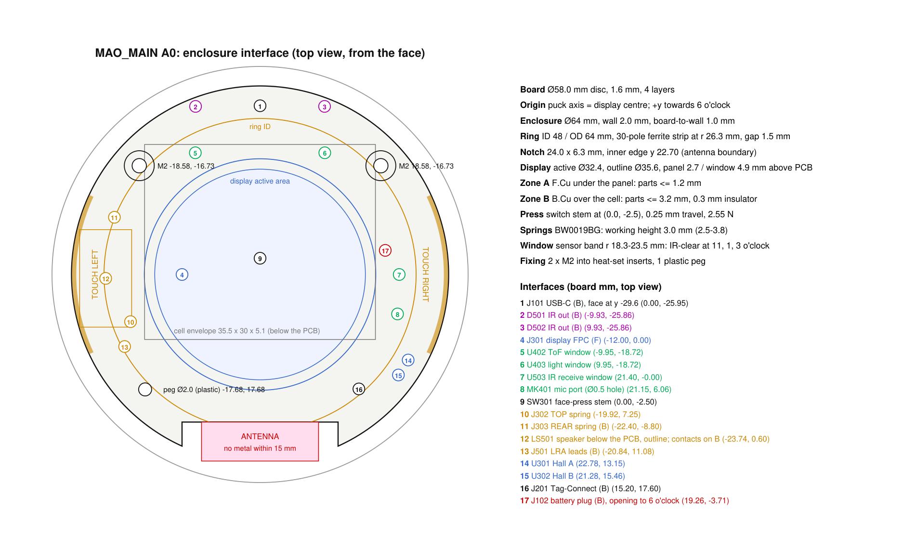

# MAO_MAIN A0: mechanical integration

Everything here comes from `hardware/mao/design/mechanical.py` (datums) and `placement.py`
(parts). The drawing below is generated from the same numbers by `design/mech_drawing.py`, so it
cannot drift from the board.

Coordinates: board millimetres, origin on the puck axis (display centre), +x to the right and +y towards
6 o'clock, viewed from the face. 12 o'clock is MAO's back (USB-C, IR); 6 o'clock faces the person.

## 1. Stack (section through the axis)

| Layer (top → bottom) | Thickness | Notes |
|---|---:|---|
| Clear window | 1.0 | **Not FDM**: FDM is never optically clear. Use laser-cut 1 mm PMMA or PC (Ø47), bonded to the display carrier so window, panel and carrier float together in the top shell's bore (§4). Back-printed or masked black except over the face and the three sensor apertures. Its underside is 4.9 mm above F.Cu (4.65 mm with the face pressed) |
| Air / foam | 0.2 | no pressure on the panel glass |
| Display, 1.28" round GC9A01 (Winstar WF0128BTYAA4DNN0, 35.6 × 37.74 × 1.56) | ~2.0 | on a printed carrier that floats with the window (press travel 0.25 mm) |
| Panel standoff | 2.7 | carrier + 0.5 mm foam; the 18-pin FPC tail folds down at 9 o'clock into the J301 connector (1.0 mm high, front entry from the rim side). Set by the tallest part under the window border, the IR receiver (4.0 ± 0.3 mm with its dome): 0.35 mm clearance at worst case with the face pressed (ODD JOBS 135) |
| PCB F.Cu side (Zone A) | (≤ 1.2) | inside the standoff, under the panel; tallest part is the SKQG switch with stem. Under the window border (sensor band) parts may reach 4.3 mm; under the ring's lower lip (r > 24 mm, lip 1.9 mm above F.Cu) ≤ 0.95 mm (0603) |
| PCB | 1.6 | 4 layers (JLC04161H-1080), black mask, ENIG |
| PCB B.Cu side (Zone B) | ≤ 3.2 | module 3.1 mm, JST SH 2.9 mm, everything else ≤ 1.2 |
| Insulator | 0.3 | Kapton or fish paper on the cell's top face |
| Cell LP503035 | 5.1 | 35.5 × 30 mm, centred at (0, −5), long axis along x |
| Base floor | 1.2 | speaker sits in the left crescent beside the cell |

Total ≈ 17.3 mm. With 0.6 mm top lip and 0.4 mm foot it comes to an 18.3 mm puck.

## 2. Board and fixing

- Ø58.0 mm disc. Antenna notch at 6 o'clock: 24.0 × 6.3 mm, inner edge at y 22.70, 1 mm milled corner radii.
- **Fixing:** two M2 screws at ±48° on r 25 mm (holes Ø2.2), from the base through the board into
  M2 heat-set inserts in the top shell.
  - A 4.6 mm keep-out ring on both faces carries the insert boss and the screw head.
  - Screws sit on the back half only: no metal within 15 mm of the antenna (ODD JOBS 69).
- **Locating peg:** one plastic peg at 225° (NPTH Ø2.0, printed peg Ø1.9) on the antenna half.
- **Board to wall:** 1.0 mm. Rib the wall so the board edge touches it in at most 4 places, so the touch arcs keep a constant gap.

## 3. Ring dial (contactless)

| Item | Value |
|---|---|
| Ring | ID 48 / OD 64 mm, printed, rides on the top shell's track. Grease (PTFE) or a 0.5 mm PTFE washer under it |
| Pole strip | **Flexible ferrite multipole strip**, about 1.5 mm thick and 3 mm wide, 165 mm long, magnetised with 30 alternating poles across its face (pitch 12°, 5.5 mm), glued into a groove in the ring's lower lip at r 26.3 mm. Ferrite in rubber does not conduct, so nothing metal sweeps over the antenna at 6 o'clock as the ring turns (sintered NdFeB magnets would, about 4–5 mm above it; ODD JOBS 2, 3) |
| Sensors | U301/U302 DRV5012 on F.Cu at r 26.3 mm, 120° and 126° (6° = a quarter of one N/S pair = quadrature) |
| Gap | strip face to sensor top 1.5 mm through the ring lip. DRV5012 switches at ±3.3 mT at most (SLIS158); order the strip to give ≥ 8 mT peak at 1.5 mm (2.4× margin) and confirm with the dial test at bring-up |
| Detent | **haptic**: the ring turns smoothly on its PTFE washer, and every one of the 30 steps per turn is a short tick from the LRA (DRV2605L "sharp tick") plus a soft sound tick, both from firmware (`dial_tick`), thinned when the ring is spun fast. It feels like the Surface Dial: a crisp tick in the fingers, nothing that wears, nothing to tune in the print |
| Firmware | 30 detents / 15 quadrature cycles per turn, rest state 00/11 (identical to the EC11, `mao_input` unchanged) |

Alternative if a mechanical click is wanted: a printed leaf spring with a 0.6 mm bump riding 30 notches on
the ring's inner wall (audible, some wear). The earlier steel-pin magnetic detent needs strong sintered
magnets, which must not pass over the antenna.

## 4. Face press

The face (window, display and printed carrier) is one rocking plate on flexures. FDM cannot hold the 0.1 mm
sliding fit a guided plunger would need, so nothing slides:

- **Suspension:** three S-shaped flexure arms printed in one piece with the carrier (PETG, 0.8 mm thick, 1.2 mm
  wide, about 18 mm long along the sensor band) at 60°, 180° and 300°, clear of the sensor apertures and the TOP
  spring. Their outer ends are pinned to bosses in the top shell. They centre the face, stop it turning with the
  ring, and preload it up against the shell's 0.6 mm lip by about 0.5 mm of deflection (≈ 0.3 N).
- **Hinge:** the lip all round is the fulcrum. A press anywhere tips the face about the lip opposite the finger
  and drives the Ø2 boss under the carrier (at (0, −2.5), reaching down through the 2.7 mm standoff) onto the
  SKQG stem. At the centre that is about 2.6 N and 0.25 mm; at the rim about 1.3 N and 0.5 mm.
- **Stop:** the switch bottoming out is the hard stop; at full travel nothing under the panel comes closer than
  0.5 mm (J301, the tallest part there). Flexure stress at full travel is about 11 MPa, a fifth of PETG's yield.
- **Feel:** a short, firm, quiet tick from the switch's dome as the face dips a fraction of a millimetre, and one
  firm LRA click on every press (firmware) so centre and rim presses feel alike.
- **Look:** a flat clear window 0.6 mm below a thin rim, so laying MAO face-down never presses it.
- The FPC needs a 2 mm service loop to survive the travel. J301's front (FPC entry) is at x −14.85, 2.95 mm inside the panel outline; with the fold at the panel edge the tail needs 10.5–12.5 mm from the glass edge to the end of its contacts. VERIFY against the panel drawing before ordering panels (any 18-pin tail of that length plugs in).
- Holding the face while plugging USB enters the ROM bootloader (GPIO0), as with the LCDkit knob.

## 5. Sensors that look out

| Sensor | Position | Window treatment |
|---|---|---|
| ToF VL53L4CD (U402) | 11 o'clock, r 21.2 | Clear aperture Ø3, no paint. The sensor top is 3.9 mm below the window, so the air gap is bridged by a **black light-blocking gasket**: closed-cell foam (PORON or EPDM) 4.2 mm free, about 3.9 mm fitted, with separate Ø1.2 openings over the emitter and the receiver, bonded to the window underside and resting on the sensor cap. This is ST AN5231's configuration for sub-1 m ranging (gasket required, window ≤ 1.5 mm, no open air gap). The 0.25 mm press travel only compresses the foam. Run crosstalk calibration at the factory station |
| Light OPT3004 (U403) | 1 o'clock, r 21.2 | Clear aperture Ø2; or a 50 % ink dot so it reads "dim" like an eye. The aperture, 4.25 mm above the die, limits the view to about ±17°: enough for room level and "covered"; calibrate the lux scale at bring-up |
| IR receiver IRM-H638T (U503) | 3 o'clock, r 21.4 | IR-transparent (visible-black) ink acceptable. The dome top (4.0 ± 0.3 mm) sits 0.6–0.9 mm under the window (0.35–0.65 mm pressed) |
| Microphone SPH0641 (MK401) | 3–4 o'clock, B.Cu, bottom port through the board | Ø0.8 hole in the window border above it, with a mesh. A foam gasket tube (Ø4 / Ø1.2, 5.2 mm free, about 4.9 mm fitted) seals the path from the copper-free ring round the port hole on F.Cu to the window hole, so the mic hears the room, not the cavity |
| IR LEDs (D501/D502) | back edge, 11 and 1 o'clock, side-emitting outwards | Ø3 IR-transparent windows in the wall (or the wall itself in IR-clear PETG) |

## 6. Touch electrodes

| Zone | Implementation |
|---|---|
| LEFT / RIGHT | Copper arcs at the board rim (E301/E302, 50° each, F+B). They sense through the 2 mm wall and the ring; nothing to build. No ground plane under them |
| TOP | Spring J302 (BW0019BG, free 3.8 mm, working 3.0 mm, limit 2.5 mm) presses on a boss that hangs from the carrier under the window border with its face 3.1 mm above F.Cu (1.8 mm below the window). The electrode is copper tape on the window's underside wrapped down over the boss, or the boss printed in conductive filament if material B is conductive. The hardest case, a rim press right beside it, takes the spring to about 2.6 mm, inside its 2.5 mm limit |
| REAR | Spring J303 presses on an electrode on the base's inner surface: copper tape or conductive filament |

## 7. Battery

- Cell under the board on the 0.3 mm insulator, held in a printed pocket in the base. It must not be the clamping element: leave 0.3 mm clearance above it for swelling.
- **Lead:** from the cell's 3 o'clock end, about 25 mm, to J102 (JST SH 3-pin) at 2 o'clock on B.Cu.
  - The opening faces 6 o'clock, so the plug lies flat over the cell end.
  - Pinout 1 BAT−, 2 NTC, 3 BAT+.
  - Order the cell with that pinout or re-terminate it, and check polarity on receipt.
- The R108 0 Ω link sits 4 mm from J102: lift it to measure battery current.

## 8. Speaker and haptics

- **Speaker:** Same Sky CMS-150803-088S-X8, 15 × 8 × 3 mm, 8 Ω, 0.8 W, 93 dB, with its own spring contacts (a round Ø15 part does not fit: the crescent beside the 35.5 mm cell is 12.2 mm wide). It lies under the board at 9 o'clock, long side along the rim, centred at (−23.74, 0.6): 1.8 mm from the cell and at least 0.8 mm from the wall at its corners.
  - Its spring contacts press up on the two pads of LS501 on B.Cu: SPK+ at (−20.65, 7.55), SPK− at (−20.65, −6.35). Its back sits about 0.25 mm under the board (the footprint's courtyard keeps every other B part out from under it); its membrane faces down.
  - A printed cradle in the base holds it and compresses its contacts to about 0.2 mm. A foam ring round its front frame seals a small printed front chamber that ducts to the slot grille in the wall at 9 o'clock; the rest of the puck's interior is its back volume.
  - Its outer edge lies over part of the LEFT touch arc; firmware holds the LEFT zone while the amplifier runs (its outputs switch at ~330 kHz).
- **LRA:** LD0832AA (Ø8 coin), glued with 3M VHB to the base under 7–8 o'clock, leads soldered to J501. Firmly coupling it to the shell makes the haptics felt in the hand.

## 9. USB-C

- The receptacle's mating face is 0.6 mm past the board edge at y −29.6.
- **Wall opening:** 9.2 × 3.6 mm, outer chamfer 0.5 mm. The wall at 12 o'clock is 2 mm, so a standard plug overmold (≤ 6.5 mm thick) seats fully.
- The 4 THT shell legs take the insertion force. The opening must not touch the shell.

## 10. Two-material print plan (Bambu X2D + 2 × AMS HT)

| Option | Material A | Material B | Use |
|---|---|---|---|
| **Recommended** | Matte PETG (or PLA-matte), body, base, ring | TPU 95A | B for the ring's grip band and four feet. Touch electrodes from copper tape |
| Electrodes printed | Matte PETG | Conductive PLA | B as the TOP and REAR electrodes, printed in the shell and contacted by the springs. Expect 1–3 kΩ/cm: fine for capacitive sensing |

- The window is a separate clear part in both options (§1).
- Print the ring flat, lip down, with the groove for the pole strip in the lip.
- Print the top shell face-down so the window bore is accurate.

## 11. Assembly order

1. Glue the pole strip into the ring's groove (check the 30 poles with magnetic viewing film or the dial test).
2. Bond the window to the display carrier, fit the display onto the carrier, fit the ToF and mic gaskets under the window border, and route the FPC. Pin the carrier's three flexure arms to the top shell's bosses.
3. Open J301's back-flip actuator, insert the FPC tail (contacts either way up: the connector contacts both faces), close the actuator. Place the board into the top shell on the peg and inserts. The display can be lifted out and replaced the same way.
4. Insulator, cell (plug J102), speaker in its cradle (contacts up, under LS501), LRA. Close the base with 2 × M2.
